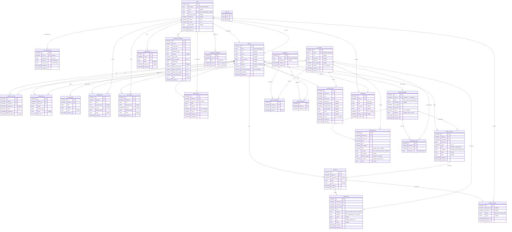

# Data Model

> RepLog schema — designed during bootstrap Feb 2026, updated for v1.1 enhancements.

## Design Decisions

These were resolved interactively before schema design:

1. **Tier lives on both athlete and exercise.** Exercise tier is classification (lunges are Foundational). Athlete tier is the coach's current assessment. The assignment table is the source of truth for "what does this person do today" — tier is not a hard constraint.

2. **Renamed `kids` → `athletes`.** The app tracks both kids (tier-based progression) and adults (percentage-based programs like 5/3/1). Tier is nullable — adults don't need it.

3. **Logging is per-set.** One row = one set = reps + weight. You can see set-to-set fatigue and partial completions. Easy to aggregate up, impossible to disaggregate down.

4. **A thin `workouts` table groups sets.** Without it you'd query by date and hope timestamps cluster. A workout row gives you a clean FK, a place for session-level notes, and simple history queries.

5. **Equipment is a shared catalog with per-athlete inventory.** Equipment items (barbell, squat rack, dumbbells, etc.) are defined once in a shared catalog managed by coaches. Each exercise can list required and optional equipment. Each athlete maintains an inventory of available equipment. The app can then determine whether an athlete has the required equipment for a given exercise — useful for filtering assignments and flagging compatibility issues.

6. **Training maxes are a first-class entity.** Required for percentage-based programs (5/3/1, GZCL). Multiple rows per exercise track TM progression over time. Even without a program engine, seeing "that was 85% of my TM" is useful.

7. **Assignments use an `active` flag, not hard deletes.** Deactivating preserves history. `assigned_at` / `deactivated_at` give you a timeline. Reactivation creates a **new row** (not a flag flip) — the new `assigned_at` reflects the reactivation date, preserving the full audit trail.

8. **Athletes can log any exercise, not just assigned ones.** The daily view highlights assigned exercises, but the logging UI has access to the full exercise library. This allows accessory work, one-off movements, and trying new exercises without formal assignment.

9. **Users and athletes are separate entities.** Users are login accounts (username + password hash + email). Athletes are training subjects. A user links to an athlete via `athlete_id` — coaches can manage all athletes, non-coaches can only view/log their own. The bootstrap logic auto-creates the first user (as coach) from env vars on first run.

10. **Three-tier access control: admin, coach, athlete.** Admins see and manage all athletes and users. Coaches see only athletes assigned to them (`coach_id`). Non-coach users (athletes) are linked to exactly one athlete and can only view/log/edit their own workouts. Roles overlap — an admin can also be a coach, and an athlete can also be a coach. The `is_admin` and `is_coach` flags on the users table control permissions.

11. **Program templates are separate from the logbook.** The app's core is a logbook — it records what happened. Program templates layer on a prescription engine: coaches define templates (weeks × days × prescribed sets with percentages), assign them to athletes, and the app calculates today's target weights from training maxes. Each athlete can have one active primary program and any number of active supplemental programs, each with a day-of-week schedule. Position advances independently per program by counting completed workouts with the matching `assignment_id`. Cycles repeat automatically when all weeks × days are exhausted.

12. **Foreign key delete behaviors are intentional.** Deleting an athlete cascades to their workouts, assignments, and training maxes. Deleting a user only unlinks their athlete profile (`SET NULL`). Deleting an exercise is restricted (`RESTRICT`) if it has been logged in any workout — prevents orphaned history.

13. **Two-level goals: long-term and per-cycle.** The `goal` column on `athletes` holds a long-term training objective ("build overall strength"). The `goal` column on `athlete_programs` holds a short-term cycle-specific goal ("increase squat TM by 10 lbs"). Both are nullable free-text fields. This separation gives future LLM-based plan generation the right context at each level.

14. **Rep type tracks per-side, timed, and distance sets.** The `rep_type` column on `prescribed_sets` and `workout_sets` uses an enum (`reps`, `each_side`, `seconds`, `distance`). This avoids encoding modifiers in notes fields — "5/ea", "30s", or "20yd" are first-class data. The `reps` column continues to hold the numeric value; `rep_type` determines how to display it.

15. **Progression rules are suggestions, not automation.** The `progression_rules` table stores per-exercise TM increment amounts for each program template (e.g. +5 lbs for upper body, +10 lbs for lower body in 5/3/1). At cycle boundaries, the app surfaces suggested TM bumps alongside AMRAP results from the completed cycle. The coach decides whether to apply, edit, or skip each suggestion. The app never auto-applies TM changes — this preserves the "logbook, not coach" principle while removing the friction of manually remembering increment rules.

16. **Prescribed sets support both percentage-based and fixed-weight programs.** Percentage-based programs (5/3/1, GZCL) use `percentage` to derive target weight from training maxes. Fixed-weight programs (Yessis 1×20, accessories) use `absolute_weight` to prescribe a specific load in pounds/kg. When both are set, percentage takes priority. Coach-controlled `sort_order` determines exercise display order within a day — critical for Yessis methodology where exercise sequence matters (compound → isolation → specialized). The `is_loop` flag on templates marks indefinite cycling programs (Yessis foundational phases) that repeat until the coach decides to advance the athlete.

17. **Journal is a read-only timeline, not a separate data store.** The journal view (`/athletes/{id}/journal`) aggregates dated events from existing tables — workouts, body weights, training max changes, goal changes, tier changes, program starts, and reviews — into a unified chronological feed via `UNION ALL`. The only new write paths are `athlete_notes` (coach free-text notes) and `tier_history` (automatic tier change recording). No denormalized journal table exists.

18. **Coach notes have public/private visibility.** The `is_private` flag on `athlete_notes` controls whether non-coach athletes can see a note. Private notes (`is_private = 1`) are coach-only; public notes (`is_private = 0`) appear on the athlete's journal view. This lets coaches keep internal observations (e.g., "watch for overtraining signs") separate from athlete-facing notes (e.g., "great progress on squat form").

## Entity Relationship Diagram


```mermaid
erDiagram
    users {
        INTEGER id PK
        TEXT username UK "COLLATE NOCASE"
        TEXT name "nullable"
        TEXT email UK "COLLATE NOCASE, nullable"
        TEXT password_hash "nullable"
        INTEGER athlete_id FK "nullable"
        INTEGER is_coach "0 or 1"
        INTEGER is_admin "0 or 1"
        TEXT avatar_path "nullable"
        DATETIME created_at
        DATETIME updated_at
    }

    user_preferences {
        INTEGER id PK
        INTEGER user_id FK "UNIQUE"
        TEXT weight_unit "lbs or kg"
        TEXT timezone "IANA timezone"
        TEXT date_format "Go format string"
        DATETIME created_at
        DATETIME updated_at
    }

    athletes {
        INTEGER id PK
        TEXT name "COLLATE NOCASE"
        TEXT tier "nullable"
        TEXT notes "nullable"
        TEXT goal "nullable"
        DATE date_of_birth "nullable"
        TEXT grade "nullable"
        TEXT gender "nullable, male/female"
        INTEGER coach_id FK "nullable"
        INTEGER track_body_weight "0 or 1, default 1"
        DATETIME created_at
        DATETIME updated_at
    }

    exercises {
        INTEGER id PK
        TEXT name UK "COLLATE NOCASE"
        TEXT tier "nullable"
        TEXT form_notes "nullable"
        TEXT demo_url "nullable"
        INTEGER rest_seconds "nullable"
        INTEGER featured "0 or 1, default 0"
        DATETIME created_at
        DATETIME updated_at
    }

    athlete_exercises {
        INTEGER id PK
        INTEGER athlete_id FK
        INTEGER exercise_id FK
        INTEGER target_reps "nullable"
        INTEGER active "0 or 1"
        DATETIME assigned_at
        DATETIME deactivated_at "nullable"
    }

    training_maxes {
        INTEGER id PK
        INTEGER athlete_id FK
        INTEGER exercise_id FK
        REAL weight
        DATE effective_date
        TEXT notes "nullable"
        DATETIME created_at
    }

    workouts {
        INTEGER id PK
        INTEGER athlete_id FK
        INTEGER assignment_id FK "nullable"
        DATE date
        TEXT notes "nullable"
        DATETIME created_at
        DATETIME updated_at
    }

    workout_sets {
        INTEGER id PK
        INTEGER workout_id FK
        INTEGER exercise_id FK
        INTEGER set_number
        INTEGER reps
        TEXT rep_type "reps, each_side, seconds, or distance"
        TEXT category "main, supplemental, or accessory"
        REAL weight "nullable"
        REAL rpe "nullable, CHECK 1-10"
        TEXT notes "nullable"
        DATETIME created_at
        DATETIME updated_at
    }

    body_weights {
        INTEGER id PK
        INTEGER athlete_id FK
        DATE date
        REAL weight
        TEXT notes "nullable"
        DATETIME created_at
    }

    users ||--o| athletes : "linked profile"
    users ||--o{ athletes : "coaches"
    users ||--o| user_preferences : "has preferences"
    athletes ||--o{ athlete_exercises : "has"
    exercises ||--o{ athlete_exercises : "assigned via"
    athletes ||--o{ training_maxes : "has"
    exercises ||--o{ training_maxes : "for"
    athletes ||--o{ workouts : "logs"
    athlete_programs ||--o{ workouts : "prescribes"
    workouts ||--o{ workout_sets : "contains"
    exercises ||--o{ workout_sets : "performed"
    athletes ||--o{ body_weights : "tracks"
    athletes ||--o{ goal_history : "goal changes"
    users ||--o{ goal_history : "set by"
    athletes ||--o{ tier_history : "tier changes"
    users ||--o{ tier_history : "set by"
    athletes ||--o{ athlete_notes : "notes"
    users ||--o{ athlete_notes : "authored by"
    workouts ||--o| workout_reviews : "reviewed via"
    users ||--o{ workout_reviews : "reviews"
    athletes ||--o{ program_templates : "owns (optional)"
    program_templates ||--o{ prescribed_sets : "defines"
    exercises ||--o{ prescribed_sets : "used in"
    athletes ||--o{ athlete_programs : "follows"
    program_templates ||--o{ athlete_programs : "assigned via"
    program_templates ||--o{ progression_rules : "has rules"
    exercises ||--o{ progression_rules : "incremented by"
    users ||--o{ login_tokens : "has"
    users ||--o{ webauthn_credentials : "has"
    equipment ||--o{ exercise_equipment : "required by"
    exercises ||--o{ exercise_equipment : "requires"
    equipment ||--o{ athlete_equipment : "owned by"
    athletes ||--o{ athlete_equipment : "has"
    athletes ||--o{ accessory_plans : "has"
    exercises ||--o{ accessory_plans : "used in"
    users ||--o{ notifications : "receives"
    athletes ||--o{ notifications : "related to"
    users ||--o{ notification_preferences : "configures"

    notifications {
        INTEGER id PK
        INTEGER user_id FK
        TEXT type "NOT NULL"
        TEXT title "NOT NULL"
        TEXT message "nullable"
        TEXT link "nullable"
        INTEGER read "0 or 1, default 0"
        INTEGER athlete_id FK "nullable"
        DATETIME created_at
    }

    notification_preferences {
        INTEGER id PK
        INTEGER user_id FK
        TEXT type "NOT NULL"
        INTEGER in_app "0 or 1, default 1"
        INTEGER external "0 or 1, default 0"
    }

    login_tokens {
        INTEGER id PK
        INTEGER user_id FK
        TEXT token UK
        TEXT label "nullable"
        DATETIME expires_at "nullable"
        DATETIME created_at
    }

    webauthn_credentials {
        INTEGER id PK
        INTEGER user_id FK
        BLOB credential_id UK
        BLOB public_key
        TEXT attestation_type
        TEXT transport "nullable"
        INTEGER sign_count
        INTEGER clone_warning "0 or 1"
        TEXT attachment
        BLOB aaguid "nullable"
        INTEGER flags_user_present "0 or 1"
        INTEGER flags_user_verified "0 or 1"
        INTEGER flags_backup_eligible "0 or 1"
        INTEGER flags_backup_state "0 or 1"
        TEXT label "nullable"
        DATETIME created_at
    }

    goal_history {
        INTEGER id PK
        INTEGER athlete_id FK
        TEXT goal
        TEXT previous_goal "nullable"
        INTEGER set_by FK "nullable"
        DATE effective_date
        TEXT notes "nullable"
        DATETIME created_at
    }

    tier_history {
        INTEGER id PK
        INTEGER athlete_id FK
        TEXT tier
        TEXT previous_tier "nullable"
        INTEGER set_by FK "nullable"
        DATE effective_date
        TEXT notes "nullable"
        DATETIME created_at
    }

    athlete_notes {
        INTEGER id PK
        INTEGER athlete_id FK
        INTEGER author_id FK "nullable"
        DATE date
        TEXT content
        INTEGER is_private "0 or 1, default 0"
        INTEGER pinned "0 or 1, default 0"
        DATETIME created_at
        DATETIME updated_at
    }

    sessions {
        TEXT token PK
        BLOB data
        REAL expiry
    }

    equipment {
        INTEGER id PK
        TEXT name UK "COLLATE NOCASE"
        TEXT description "nullable"
        DATETIME created_at
        DATETIME updated_at
    }

    exercise_equipment {
        INTEGER id PK
        INTEGER exercise_id FK
        INTEGER equipment_id FK
        INTEGER optional "0 or 1"
    }

    athlete_equipment {
        INTEGER id PK
        INTEGER athlete_id FK
        INTEGER equipment_id FK
    }

    accessory_plans {
        INTEGER id PK
        INTEGER athlete_id FK
        INTEGER day
        INTEGER exercise_id FK
        INTEGER target_sets "nullable"
        INTEGER target_rep_min "nullable"
        INTEGER target_rep_max "nullable"
        REAL target_weight "nullable"
        TEXT notes "nullable"
        INTEGER sort_order "default 0"
        INTEGER active "0 or 1, default 1"
        DATETIME created_at
        DATETIME updated_at
    }

    workout_reviews {
        INTEGER id PK
        INTEGER workout_id FK "UNIQUE"
        INTEGER coach_id FK "nullable"
        TEXT status "approved or needs_work"
        TEXT notes "nullable"
        DATETIME created_at
        DATETIME updated_at
    }

    program_templates {
        INTEGER id PK
        INTEGER athlete_id FK "nullable, FK → athletes(id)"
        TEXT name "NOT NULL COLLATE NOCASE"
        TEXT description "nullable"
        INTEGER num_weeks
        INTEGER num_days
        INTEGER is_loop "0 or 1, default 0"
        TEXT audience "nullable, 'youth' or 'adult'"
        DATETIME created_at
        DATETIME updated_at
    }

    prescribed_sets {
        INTEGER id PK
        INTEGER template_id FK
        INTEGER exercise_id FK
        INTEGER week
        INTEGER day
        INTEGER set_number
        INTEGER reps "nullable, NULL = AMRAP"
        TEXT rep_type "reps, each_side, seconds, or distance"
        REAL percentage "nullable"
        REAL absolute_weight "nullable, fixed weight"
        INTEGER sort_order "display order within day"
        TEXT notes "nullable"
    }

    athlete_programs {
        INTEGER id PK
        INTEGER athlete_id FK
        INTEGER template_id FK
        DATE start_date
        INTEGER active "0 or 1"
        TEXT role "primary or supplemental"
        TEXT schedule "nullable, JSON weekday array"
        TEXT notes "nullable"
        TEXT goal "nullable"
        DATETIME created_at
        DATETIME updated_at
    }

    progression_rules {
        INTEGER id PK
        INTEGER template_id FK
        INTEGER exercise_id FK
        REAL increment "TM bump amount"
    }
```

## Schema

### `users`

| Column          | Type         | Constraints                          |
|----------------|-------------|--------------------------------------|
| `id`           | INTEGER      | PRIMARY KEY AUTOINCREMENT            |
| `username`     | TEXT         | NOT NULL UNIQUE COLLATE NOCASE       |
| `name`         | TEXT         | NULL                                 |
| `email`        | TEXT         | NULL UNIQUE COLLATE NOCASE            |
| `password_hash`| TEXT         | NULL                                 |
| `athlete_id`   | INTEGER      | NULL, FK → athletes(id)              |
| `is_coach`     | INTEGER      | NOT NULL DEFAULT 0, CHECK(is_coach IN (0, 1)) |
| `is_admin`     | INTEGER      | NOT NULL DEFAULT 0, CHECK(is_admin IN (0, 1)) |
| `mcp_enabled`  | INTEGER      | NOT NULL DEFAULT 0, CHECK(mcp_enabled IN (0, 1)) |
| `pocketid_sub` | TEXT         | NULL, UNIQUE (partial index WHERE NOT NULL) |
| `avatar_path`  | TEXT         | NULL                                 |
| `created_at`   | DATETIME     | NOT NULL DEFAULT CURRENT_TIMESTAMP   |
| `updated_at`   | DATETIME     | NOT NULL DEFAULT CURRENT_TIMESTAMP   |

- Login accounts, not training subjects. Separate from athletes.
- `email` for password reset or notifications in the future. Required for coaches, optional for kids.
- `athlete_id` links the user to "their" athlete profile. NULL for coach-only accounts without a personal training profile.
- `is_coach = 1` → full access to all athletes. `is_coach = 0` → can only view/log/edit workouts for their linked athlete.
- `avatar_path` stores the relative path to the user's uploaded avatar image. NULL if no avatar has been uploaded.
- `COLLATE NOCASE` prevents "Admin" and "admin" or duplicate emails.
- Bootstrap: if `COUNT(*) = 0` on startup, insert from `REPLOG_ADMIN_USER` / `REPLOG_ADMIN_PASS` / `REPLOG_ADMIN_EMAIL` env vars with `is_coach = 1`.
- `mcp_enabled` gates whether the user may act through the MCP layer (ADR 017, ADR 019). Default-deny; an admin toggles it per user via `PUT /api/users/{userID}/mcp`. Added in migration `0005`. As of ADR 019 Phases 2+3, RepLog is its OWN MCP OAuth Authorization Server: it mints opaque `rlpat_` bearer tokens (stored SHA-256-hashed in `mcp_tokens`) after federating login to PocketID, and the native `/api/mcp` server validates them directly — no external JWKS, no `homelab-mcp` wrapper.
- `pocketid_sub` is the PocketID OIDC subject (`sub` claim), the authoritative identity key for the webui once RepLog became a PocketID relying party (ADR 019 Phase 1, migration `0009`). Set on a user's first OIDC login — matched first; else, if the ID token carries `email_verified == true`, the existing account is matched by email and bound; else a passwordless user is JIT-created. Uniqueness is enforced by a partial index (`WHERE pocketid_sub IS NOT NULL`) because SQLite's `ALTER TABLE ADD COLUMN` cannot add an inline `UNIQUE` column. `password_hash` is retained as documented break-glass; the dormant `webauthn_credentials` table is left for a later cleanup migration.

### `user_preferences`

| Column        | Type         | Constraints                          |
|--------------|-------------|--------------------------------------|
| `id`         | INTEGER      | PRIMARY KEY AUTOINCREMENT            |
| `user_id`    | INTEGER      | NOT NULL UNIQUE, FK → users(id) ON DELETE CASCADE |
| `weight_unit`| TEXT         | NOT NULL DEFAULT 'lbs', CHECK(weight_unit IN ('lbs', 'kg')) |
| `timezone`   | TEXT         | NOT NULL DEFAULT 'America/New_York'  |
| `date_format`| TEXT         | NOT NULL DEFAULT 'Jan 2, 2006'       |
| `created_at` | DATETIME     | NOT NULL DEFAULT CURRENT_TIMESTAMP   |
| `updated_at` | DATETIME     | NOT NULL DEFAULT CURRENT_TIMESTAMP   |

- One row per user — stores display and locale preferences.
- `weight_unit` controls how weights are labeled throughout the UI ('lbs' or 'kg'). Weights are stored in the user's chosen unit — no automatic conversion.
- `timezone` is an IANA timezone identifier (e.g. 'America/New_York', 'Europe/London'). Used for displaying dates in the user's local time.
- `date_format` is a Go `time.Format` string (e.g. 'Jan 2, 2006', '2006-01-02', '01/02/2006').
- Default preferences are seeded on login if no row exists.
- Deleting a user cascades to their preferences.

### `athletes`

| Column              | Type         | Constraints                          |
|--------------------|-------------|--------------------------------------|
| `id`               | INTEGER      | PRIMARY KEY AUTOINCREMENT            |
| `name`             | TEXT         | NOT NULL COLLATE NOCASE               |
| `tier`             | TEXT         | NULL, CHECK(tier IN ('foundational','intermediate','sport_performance')) |
| `notes`            | TEXT         | NULL                                 |
| `goal`             | TEXT         | NULL                                 |
| `date_of_birth`    | DATE         | NULL                                 |
| `grade`            | TEXT         | NULL                                 |
| `gender`           | TEXT         | NULL, CHECK(gender IN ('male','female')) |
| `coach_id`         | INTEGER      | NULL, FK → users(id)                 |
| `track_body_weight`| INTEGER      | NOT NULL DEFAULT 1, CHECK(track_body_weight IN (0, 1)) |
| `created_at`       | DATETIME     | NOT NULL DEFAULT CURRENT_TIMESTAMP   |
| `updated_at`       | DATETIME     | NOT NULL DEFAULT CURRENT_TIMESTAMP   |

- `tier` is nullable — adults running their own programs don't use the tier system.
- The three youth tier values map to the Yessis phase progression:
  `foundational` = the 1×20 entry phase (bodyweight + light dumbbells, 15–20 reps),
  `intermediate` = the 1×15 bridge phase (weighted variations and light barbell work over the 1×20 base, 15 reps),
  `sport_performance` = the monthly sport-performance blocks (compound lifts, power work, percentage-based loading once TMs exist).
  See `docs/seed-catalog.md` for the seeded reference programs that anchor each phase.
- `notes` holds free-form coaching observations ("ready to try intermediate bench").
- `goal` holds a long-term training objective ("build overall strength", "prepare for football season"). Nullable.
- `date_of_birth` stores the athlete's birth date for age computation. Used by the LLM to make age-appropriate programming decisions.
- `grade` is a free-text school grade or year (e.g. "9th", "Junior"). Helps inform sport season scheduling.
- `gender` is "male" or "female". Used by the LLM for gender-aware loading norms and reference ranges.
- `track_body_weight` controls whether body weight tracking UI is visible for this athlete. Defaults to enabled.

### `exercises`

| Column       | Type         | Constraints                          |
|-------------|-------------|--------------------------------------|
| `id`        | INTEGER      | PRIMARY KEY AUTOINCREMENT            |
| `name`      | TEXT         | NOT NULL UNIQUE COLLATE NOCASE        |
| `tier`      | TEXT         | NULL, CHECK(tier IN ('foundational','intermediate','sport_performance')) |
| `form_notes`| TEXT         | NULL                                 |
| `demo_url`  | TEXT         | NULL                                 |
| `rest_seconds`| INTEGER    | NULL                                 |
| `featured`  | INTEGER      | NOT NULL DEFAULT 0, CHECK(featured IN (0, 1)) |
| `created_at`| DATETIME     | NOT NULL DEFAULT CURRENT_TIMESTAMP   |
| `updated_at`| DATETIME     | NOT NULL DEFAULT CURRENT_TIMESTAMP   |

- `tier` is nullable — general lifts (squat, bench, deadlift) exist independent of the kids' tier system.
- `form_notes` holds static coaching cues ("keep elbows tucked").
- `rest_seconds` is the recommended rest between sets in seconds. NULL means use the app default (90s). Passed to the client-side rest timer after logging a set.
- `demo_url` links to a video demonstrating proper form.
- `featured` marks exercises that appear on the featured lifts dashboard. Defaults to not featured.

### `athlete_exercises`

| Column          | Type         | Constraints                          |
|----------------|-------------|--------------------------------------|
| `id`           | INTEGER      | PRIMARY KEY AUTOINCREMENT            |
| `athlete_id`   | INTEGER      | NOT NULL, FK → athletes(id)          |
| `exercise_id`  | INTEGER      | NOT NULL, FK → exercises(id)         |
| `target_reps`  | INTEGER      | NULL                                 |
| `active`       | INTEGER      | NOT NULL DEFAULT 1, CHECK(active IN (0, 1)) |
| `assigned_at`  | DATETIME     | NOT NULL DEFAULT CURRENT_TIMESTAMP   |
| `deactivated_at`| DATETIME    | NULL                                 |

- `target_reps` is the per-assignment prescription — rep targets vary by athlete even for the same exercise.
- Partial unique index ensures only one active assignment per athlete+exercise at a time.
- Deactivation sets `active = 0` and populates `deactivated_at`.
- Reactivation creates a new row (preserves audit trail with fresh `assigned_at`).
- History is preserved; query `WHERE active = 1` for current assignments.

### `training_maxes`

| Column          | Type         | Constraints                          |
|----------------|-------------|--------------------------------------|
| `id`           | INTEGER      | PRIMARY KEY AUTOINCREMENT            |
| `athlete_id`   | INTEGER      | NOT NULL, FK → athletes(id)          |
| `exercise_id`  | INTEGER      | NOT NULL, FK → exercises(id)         |
| `weight`       | REAL         | NOT NULL                             |
| `effective_date`| DATE        | NOT NULL                             |
| `notes`        | TEXT         | NULL                                 |
| `created_at`   | DATETIME     | NOT NULL DEFAULT CURRENT_TIMESTAMP   |

- Multiple rows per athlete+exercise track TM progression over time.
- `effective_date` allows backdating or planning ahead.
- Current TM = most recent row by `effective_date` for a given athlete+exercise.

### `workouts`

| Column       | Type         | Constraints                          |
|-------------|-------------|--------------------------------------|
| `id`        | INTEGER      | PRIMARY KEY AUTOINCREMENT            |
| `athlete_id`| INTEGER      | NOT NULL, FK → athletes(id)          |
| `assignment_id`| INTEGER   | NULL, FK → athlete_programs(id) ON DELETE SET NULL |
| `date`      | DATE         | NOT NULL                             |
| `discipline`| TEXT         | NOT NULL DEFAULT 'resistance', CHECK(discipline IN ('resistance','conditioning','throwing','skill','recovery')) |
| `notes`     | TEXT         | NULL                                 |
| `created_at`| DATETIME     | NOT NULL DEFAULT CURRENT_TIMESTAMP   |
| `updated_at`| DATETIME     | NOT NULL DEFAULT CURRENT_TIMESTAMP   |

- One row per training session. `workouts` is the **multi-modal session parent** (ADR 018, migration 0006): `discipline` discriminates resistance / conditioning / throwing / skill / recovery. The name `workouts` was kept (a rename would churn ~23 query sites for zero gain).
- `discipline` defaults to `'resistance'` — every pre-ADR-018 row is resistance, and the existing resistance read paths (`GetWorkoutByAthleteDate`, `ListWorkouts`, `WorkoutStats`) filter `discipline = 'resistance'` so non-resistance sessions never leak into the lifting UI.
- `assignment_id` links the workout to the program assignment it was prescribed from. NULL for ad-hoc workouts. **Invariant** `CHECK(assignment_id IS NULL OR discipline = 'resistance')` — only resistance sessions carry an assignment, which protects `GetPrescription`'s position counter (non-resistance disciplines are log-and-flag, no program).
- `notes` holds session-level observations ("knee was bothering her today").
- UNIQUE(athlete_id, date, **discipline**) — one session per athlete per day *per discipline*, so a lift and a bullpen can both be logged on the same date. (Widened from `UNIQUE(athlete_id, date)` in migration 0006 via a `defer_foreign_keys=ON` table rebuild.)
- Index on `assignment_id` for position-counting queries.

### `workout_sets`

| Column       | Type         | Constraints                          |
|-------------|-------------|--------------------------------------|
| `id`        | INTEGER      | PRIMARY KEY AUTOINCREMENT            |
| `workout_id`| INTEGER      | NOT NULL, FK → workouts(id)          |
| `exercise_id`| INTEGER     | NOT NULL, FK → exercises(id)         |
| `set_number`| INTEGER      | NOT NULL                             |
| `reps`      | INTEGER      | NOT NULL                             |
| `weight`    | REAL         | NULL                                 |
| `rep_type`  | TEXT         | NOT NULL DEFAULT 'reps', CHECK(rep_type IN ('reps', 'each_side', 'seconds', 'distance')) |
| `category`  | TEXT         | NOT NULL DEFAULT 'main', CHECK(category IN ('main', 'supplemental', 'accessory')) |
| `rpe`       | REAL         | NULL, CHECK(rpe >= 1 AND rpe <= 10)  |
| `notes`     | TEXT         | NULL                                 |
| `created_at`| DATETIME     | NOT NULL DEFAULT CURRENT_TIMESTAMP   |
| `updated_at`| DATETIME     | NOT NULL DEFAULT CURRENT_TIMESTAMP   |

- One row = one set.
- `weight` is nullable — bodyweight exercises (push-ups, bear crawls) don't need it.
- `rep_type` determines how `reps` is displayed: `reps` → "5", `each_side` → "5/ea", `seconds` → "30s", `distance` → "20yd".
- `category` classifies sets: `main` for programmed lifts, `supplemental` for lighter program work, `accessory` for accessory exercises. Defaults to `main`.
- `rpe` is rate of perceived exertion (1–10 scale, half-steps allowed). Nullable — only logged when the athlete reports it.
- `set_number` preserves ordering within exercise within workout.
- `notes` holds per-set observations ("form broke down on rep 18").

### `body_weights`

| Column       | Type         | Constraints                          |
|-------------|-------------|--------------------------------------|
| `id`        | INTEGER      | PRIMARY KEY AUTOINCREMENT            |
| `athlete_id`| INTEGER      | NOT NULL, FK → athletes(id)          |
| `date`      | DATE         | NOT NULL                             |
| `weight`    | REAL         | NOT NULL                             |
| `notes`     | TEXT         | NULL                                 |
| `created_at`| DATETIME     | NOT NULL DEFAULT CURRENT_TIMESTAMP   |

- One weigh-in per athlete per day (`UNIQUE(athlete_id, date)`).
- `weight` stored in the athlete's preferred unit (lb or kg) — unit convention is per-deployment, not per-row.
- Deleting an athlete cascades to their body weight history.

### `goal_history`

| Column          | Type         | Constraints                          |
|----------------|-------------|--------------------------------------|
| `id`           | INTEGER      | PRIMARY KEY AUTOINCREMENT            |
| `athlete_id`   | INTEGER      | NOT NULL, FK → athletes(id) ON DELETE CASCADE |
| `goal`         | TEXT         | NOT NULL                             |
| `previous_goal`| TEXT         | NULL                                 |
| `set_by`       | INTEGER      | NULL, FK → users(id) ON DELETE SET NULL |
| `effective_date`| DATE        | NOT NULL DEFAULT (date('now'))       |
| `notes`        | TEXT         | NULL                                 |
| `created_at`   | DATETIME     | NOT NULL DEFAULT CURRENT_TIMESTAMP   |

- Append-only history of **athlete-level** goal changes (the long-term objective on `athletes.goal`).
- Per-cycle goals live on `athlete_programs.goal` and are inherently historized — each cycle is a separate row, so no additional history table is needed. See design note 13 above for the two-level goal distinction.
- `goal` is the new goal text. `previous_goal` is the prior goal (NULL if this is the first goal set).
- `set_by` records which user (coach/admin) made the change. SET NULL on user deletion preserves the history entry.
- `effective_date` defaults to today. Allows backdating if needed.
- `notes` holds optional context for the change ("Shifting focus after knee recovery").
- Current goal is still read from `athletes.goal` for quick access — this table provides the historical timeline.
- Deleting an athlete cascades to their goal history.

### `tier_history`

| Column          | Type         | Constraints                          |
|----------------|-------------|--------------------------------------|
| `id`           | INTEGER      | PRIMARY KEY AUTOINCREMENT            |
| `athlete_id`   | INTEGER      | NOT NULL, FK → athletes(id) ON DELETE CASCADE |
| `tier`         | TEXT         | NOT NULL, CHECK(tier IN ('foundational', 'intermediate', 'sport_performance')) |
| `previous_tier`| TEXT         | NULL, CHECK(previous_tier IN ('foundational', 'intermediate', 'sport_performance')) |
| `set_by`       | INTEGER      | NULL, FK → users(id) ON DELETE SET NULL |
| `effective_date`| DATE        | NOT NULL DEFAULT (date('now'))       |
| `notes`        | TEXT         | NULL                                 |
| `created_at`   | DATETIME     | NOT NULL DEFAULT CURRENT_TIMESTAMP   |

- Append-only history of tier transitions (e.g., foundational → intermediate).
- Same pattern as `goal_history` — the current tier is still read from `athletes.tier` for quick access.
- `previous_tier` is NULL when the tier is first set on a new athlete.
- Automatically recorded when a coach edits or promotes an athlete's tier.
- Deleting an athlete cascades to their tier history.

### `athlete_notes`

| Column       | Type         | Constraints                          |
|-------------|-------------|--------------------------------------|
| `id`        | INTEGER      | PRIMARY KEY AUTOINCREMENT            |
| `athlete_id`| INTEGER      | NOT NULL, FK → athletes(id) ON DELETE CASCADE |
| `author_id` | INTEGER      | NULL, FK → users(id) ON DELETE SET NULL |
| `date`      | DATE         | NOT NULL DEFAULT (date('now'))       |
| `content`   | TEXT         | NOT NULL                             |
| `is_private`| INTEGER      | NOT NULL DEFAULT 0, CHECK(is_private IN (0, 1)) |
| `pinned`    | INTEGER      | NOT NULL DEFAULT 0, CHECK(pinned IN (0, 1)) |
| `created_at`| DATETIME     | NOT NULL DEFAULT CURRENT_TIMESTAMP   |
| `updated_at`| DATETIME     | NOT NULL DEFAULT CURRENT_TIMESTAMP   |

- Free-form coach notes attached to an athlete, shown on the journal timeline.
- `is_private = 1` means only coaches/admins can see the note; `is_private = 0` means the athlete can see it too.
- `pinned` notes appear at the top of the journal regardless of date.
- `author_id` records who wrote the note. SET NULL on user deletion preserves the note.
- `date` defaults to today but can be set to any date (e.g., backdating a note from a conversation).
- Deleting an athlete cascades to their notes.

### `workout_reviews`

| Column       | Type         | Constraints                          |
|-------------|-------------|--------------------------------------|
| `id`        | INTEGER      | PRIMARY KEY AUTOINCREMENT            |
| `workout_id`| INTEGER      | NOT NULL UNIQUE, FK → workouts(id) ON DELETE CASCADE |
| `coach_id`  | INTEGER      | NULL, FK → users(id) ON DELETE SET NULL |
| `status`    | TEXT         | NOT NULL, CHECK(status IN ('approved', 'needs_work')) |
| `notes`     | TEXT         | NULL                                 |
| `created_at`| DATETIME     | NOT NULL DEFAULT CURRENT_TIMESTAMP   |
| `updated_at`| DATETIME     | NOT NULL DEFAULT CURRENT_TIMESTAMP   |

- One review per workout (`UNIQUE(workout_id)`) — coaches can update their review but there is only one.
- `status` is either `approved` (coach is satisfied) or `needs_work` (coach wants the athlete to address feedback).
- `notes` holds coach feedback ("Great form on the deadlifts! Try to go deeper on squats next time.").
- `coach_id` records which coach submitted the review.
- Deleting a workout cascades to its review. Deleting the reviewing coach sets `coach_id` to NULL, preserving the review.

### `program_templates`

| Column       | Type         | Constraints                          |
|-------------|-------------|--------------------------------------|
| `id`        | INTEGER      | PRIMARY KEY AUTOINCREMENT            |
| `athlete_id`| INTEGER      | NULL, FK → athletes(id) ON DELETE CASCADE |
| `name`      | TEXT         | NOT NULL COLLATE NOCASE              |
| `description`| TEXT        | NULL                                 |
| `num_weeks` | INTEGER      | NOT NULL                             |
| `num_days`  | INTEGER      | NOT NULL                             |
| `is_loop`   | INTEGER      | NOT NULL DEFAULT 0, CHECK(0 or 1)    |
| `audience`  | TEXT         | NULL, CHECK('youth' or 'adult')      |
| `created_at`| DATETIME     | NOT NULL DEFAULT CURRENT_TIMESTAMP   |
| `updated_at`| DATETIME     | NOT NULL DEFAULT CURRENT_TIMESTAMP   |

- Defines a reusable training program structure (e.g. "5/3/1 BBB", "GZCL T1/T2/T3").
- `num_weeks` and `num_days` define the cycle length — e.g. 4 weeks × 4 days for 5/3/1.
- `is_loop = 1` marks indefinite cycling programs (e.g. Yessis 1×20 foundational) that repeat until the coach advances the athlete. `is_loop = 0` (default) for standard programs that still cycle but show completion progress.
- `athlete_id` NULL = global/shared template (coach-created, assignable to any athlete). Non-NULL = athlete-specific template (e.g. AI-generated), visible only to that athlete.
- `audience` classifies the program as `'youth'` or `'adult'`. NULL means unclassified (e.g. athlete-scoped AI-generated programs inherit audience from the athlete's tier). Used to filter reference programs in LLM context: youth athletes only see youth reference programs, adults only see adult programs.
- Uniqueness is enforced via two partial unique indexes: global template names are unique (`WHERE athlete_id IS NULL`), and per-athlete template names are unique within that athlete (`WHERE athlete_id IS NOT NULL`).
- Assignment to athletes is tracked via `athlete_programs`.

### `prescribed_sets`

| Column       | Type         | Constraints                          |
|-------------|-------------|--------------------------------------|
| `id`        | INTEGER      | PRIMARY KEY AUTOINCREMENT            |
| `template_id`| INTEGER     | NOT NULL, FK → program_templates(id) |
| `exercise_id`| INTEGER     | NOT NULL, FK → exercises(id)         |
| `week`      | INTEGER      | NOT NULL                             |
| `day`       | INTEGER      | NOT NULL                             |
| `set_number`| INTEGER      | NOT NULL                             |
| `reps`      | INTEGER      | NULL (NULL = AMRAP)                  |
| `rep_type`  | TEXT         | NOT NULL DEFAULT 'reps', CHECK(rep_type IN ('reps', 'each_side', 'seconds', 'distance')) |
| `percentage`| REAL         | NULL (% of training max)             |
| `absolute_weight`| REAL    | NULL (fixed weight in lbs/kg)        |
| `sort_order`| INTEGER      | NOT NULL DEFAULT 0                   |
| `notes`     | TEXT         | NULL                                 |

- Each row is one prescribed set within a template's week/day.
- `reps = NULL` indicates an AMRAP (as many reps as possible) set.
- `rep_type` determines how `reps` is displayed: `reps` → "5", `each_side` → "5/ea", `seconds` → "30s", `distance` → "20yd".
- `percentage` is a decimal (e.g. 65.0 for 65%) used to calculate target weight from the athlete's training max.
- `absolute_weight` is a fixed weight for programs that don't use percentage-of-TM (e.g. Yessis foundational, accessories). When both `percentage` and `absolute_weight` are set, percentage takes priority.
- `sort_order` controls exercise display order within a day. All sets for the same exercise share the same sort_order. Lower values appear first. Critical for methodologies where exercise sequence matters.
- `UNIQUE(template_id, week, day, exercise_id, set_number)` prevents duplicate sets.

### `athlete_programs`

| Column       | Type         | Constraints                          |
|-------------|-------------|--------------------------------------|
| `id`        | INTEGER      | PRIMARY KEY AUTOINCREMENT            |
| `athlete_id`| INTEGER      | NOT NULL, FK → athletes(id)          |
| `template_id`| INTEGER     | NOT NULL, FK → program_templates(id) |
| `start_date`| DATE         | NOT NULL                             |
| `active`    | INTEGER      | NOT NULL DEFAULT 1, CHECK(0 or 1)    |
| `role`      | TEXT         | NOT NULL DEFAULT 'primary', CHECK('primary', 'supplemental') |
| `schedule`  | TEXT         | NULL — JSON array of ISO weekday numbers e.g. '[2,4]' |
| `notes`     | TEXT         | NULL                                 |
| `goal`      | TEXT         | NULL                                 |
| `created_at`| DATETIME     | NOT NULL DEFAULT CURRENT_TIMESTAMP   |
| `updated_at`| DATETIME     | NOT NULL DEFAULT CURRENT_TIMESTAMP   |

- Links an athlete to a program template.
- `role` distinguishes primary programs (one active allowed) from supplemental programs (unlimited active).
- `schedule` is a JSON array of ISO weekday numbers (1=Monday through 7=Sunday). NULL means "any day not claimed by another program" (default for primary). Supplementals must have a schedule.
- Partial unique index enforces one active primary program per athlete: `WHERE active = 1 AND role = 'primary'`.
- Schedule conflicts are validated at assignment time — no two active programs may claim the same weekday.
- Deactivation sets `active = 0`; reassignment creates a new row.
- `start_date` is the reference point for program position. Position advances by counting completed workouts with matching `assignment_id` on the `workouts` table.
- `goal` holds a cycle-specific training goal ("increase squat TM by 10 lbs"). Nullable.
- Program cycles repeat automatically when all weeks × days are exhausted.

### `progression_rules`

| Column        | Type         | Constraints                          |
|--------------|-------------|--------------------------------------|
| `id`         | INTEGER      | PRIMARY KEY AUTOINCREMENT            |
| `template_id`| INTEGER      | NOT NULL, FK → program_templates(id) ON DELETE CASCADE |
| `exercise_id`| INTEGER      | NOT NULL, FK → exercises(id) ON DELETE CASCADE |
| `increment`  | REAL         | NOT NULL                             |

- Per-exercise training max increment rule within a program template.
- `increment` is the suggested TM bump amount (e.g. 5.0 or 10.0 lbs) after a successful cycle.
- `UNIQUE(template_id, exercise_id)` — one rule per exercise per template.
- Cascades on delete from both template and exercise sides.
- Used by the cycle review screen to suggest TM updates — the coach still decides whether to apply, edit, or skip.

### `login_tokens`

| Column       | Type         | Constraints                          |
|-------------|-------------|--------------------------------------|
| `id`        | INTEGER      | PRIMARY KEY AUTOINCREMENT            |
| `user_id`   | INTEGER      | NOT NULL, FK → users(id) ON DELETE CASCADE |
| `token`     | TEXT         | NOT NULL UNIQUE                      |
| `label`     | TEXT         | NULL                                 |
| `expires_at`| DATETIME     | NULL                                 |
| `created_at`| DATETIME     | NOT NULL DEFAULT CURRENT_TIMESTAMP   |

- Passwordless login tokens — generated by coaches/admins and given to athletes for first-time device enrollment.
- `token` stores the **SHA-256 hash** of the login token, not the raw value (ADR 021). The usable token is returned only once, at creation time, and is never persisted in a notification. Lookup is by hash. This matches the at-rest treatment of MCP tokens (ADR 019).
- `label` is an optional human-readable name for the token (e.g. "Caydan's iPad").
- `expires_at` is optional — NULL means the token never expires.
- Deleting a user cascades to their login tokens.

### `webauthn_credentials`

> **Retired (ADR 019).** Passkeys/WebAuthn were retired in favor of PocketID OIDC. This table may still exist for historical rows but is no longer written or read by the application. It is documented here for completeness only.

| Column                | Type         | Constraints                          |
|----------------------|-------------|--------------------------------------|
| `id`                 | INTEGER      | PRIMARY KEY AUTOINCREMENT            |
| `user_id`            | INTEGER      | NOT NULL, FK → users(id) ON DELETE CASCADE |
| `credential_id`      | BLOB         | NOT NULL UNIQUE                      |
| `public_key`         | BLOB         | NOT NULL                             |
| `attestation_type`   | TEXT         | NOT NULL DEFAULT ''                  |
| `transport`          | TEXT         | NULL                                 |
| `sign_count`         | INTEGER      | NOT NULL DEFAULT 0                   |
| `clone_warning`      | INTEGER      | NOT NULL DEFAULT 0, CHECK(0 or 1)    |
| `attachment`         | TEXT         | NOT NULL DEFAULT ''                  |
| `aaguid`             | BLOB         | NULL                                 |
| `flags_user_present` | INTEGER      | NOT NULL DEFAULT 0, CHECK(0 or 1)    |
| `flags_user_verified`| INTEGER      | NOT NULL DEFAULT 0, CHECK(0 or 1)    |
| `flags_backup_eligible`| INTEGER    | NOT NULL DEFAULT 0, CHECK(0 or 1)    |
| `flags_backup_state` | INTEGER      | NOT NULL DEFAULT 0, CHECK(0 or 1)    |
| `label`              | TEXT         | NULL                                 |
| `created_at`         | DATETIME     | NOT NULL DEFAULT CURRENT_TIMESTAMP   |

- WebAuthn/passkey credentials for passwordless authentication.
- Each user can register multiple passkeys (one per device).
- `credential_id` and `public_key` are the core WebAuthn credential data.
- `sign_count` tracks authentication counter for clone detection.
- `flags_*` columns store the WebAuthn authenticator flags.
- `label` is an optional human-readable name for the passkey (e.g. "iPhone", "YubiKey").
- Deleting a user cascades to their credentials.

### `sessions`

| Column  | Type  | Constraints     |
|---------|-------|-----------------|
| `token` | TEXT  | PRIMARY KEY     |
| `data`  | BLOB  | NOT NULL        |
| `expiry`| REAL  | NOT NULL        |

- Session store for `alexedwards/scs` session manager.
- Managed entirely by the scs library — not accessed directly by application code.
- `token` is the session ID sent to the client as a cookie.
- `expiry` is a Unix timestamp used by scs for automatic cleanup.

### `app_settings`

| Column  | Type | Constraints          |
|---------|------|----------------------|
| `key`   | TEXT | PRIMARY KEY NOT NULL |
| `value` | TEXT | NOT NULL             |

- Key-value store for runtime configuration (LLM provider, model, API key, etc.).
- Resolution chain: environment variable → `app_settings` row → built-in default.
- Sensitive values (API keys) are stored encrypted with AES-256-GCM, prefixed with `enc:`.
- Managed via the admin Settings page.

## SQLite DDL

```sql
PRAGMA journal_mode = WAL;
PRAGMA busy_timeout = 5000;
PRAGMA foreign_keys = ON;

CREATE TABLE IF NOT EXISTS athletes (
    id          INTEGER PRIMARY KEY AUTOINCREMENT,
    name        TEXT    NOT NULL COLLATE NOCASE,
    tier        TEXT    CHECK(tier IN ('foundational', 'intermediate', 'sport_performance')),
    notes       TEXT,
    goal        TEXT,
    date_of_birth DATE,
    grade       TEXT,
    gender      TEXT    CHECK(gender IN ('male', 'female')),
    coach_id    INTEGER REFERENCES users(id) ON DELETE SET NULL,
    track_body_weight INTEGER NOT NULL DEFAULT 1 CHECK(track_body_weight IN (0, 1)),
    created_at  DATETIME NOT NULL DEFAULT CURRENT_TIMESTAMP,
    updated_at  DATETIME NOT NULL DEFAULT CURRENT_TIMESTAMP
);

CREATE TABLE IF NOT EXISTS users (
    id              INTEGER PRIMARY KEY AUTOINCREMENT,
    username        TEXT    NOT NULL UNIQUE COLLATE NOCASE,
    name            TEXT,
    email           TEXT    UNIQUE COLLATE NOCASE,
    password_hash   TEXT,
    athlete_id      INTEGER REFERENCES athletes(id) ON DELETE SET NULL,
    is_coach        INTEGER NOT NULL DEFAULT 0 CHECK(is_coach IN (0, 1)),
    is_admin        INTEGER NOT NULL DEFAULT 0 CHECK(is_admin IN (0, 1)),
    mcp_enabled     INTEGER NOT NULL DEFAULT 0 CHECK(mcp_enabled IN (0, 1)),
    pocketid_sub    TEXT,   -- PocketID OIDC subject; UNIQUE via partial index (migration 0009)
    avatar_path     TEXT,
    created_at      DATETIME NOT NULL DEFAULT CURRENT_TIMESTAMP,
    updated_at      DATETIME NOT NULL DEFAULT CURRENT_TIMESTAMP
);

-- Partial unique index: SQLite's ALTER TABLE ADD COLUMN cannot add an inline
-- UNIQUE column, so uniqueness on the OIDC subject is enforced here.
CREATE UNIQUE INDEX idx_users_pocketid_sub ON users(pocketid_sub) WHERE pocketid_sub IS NOT NULL;
    id          INTEGER PRIMARY KEY AUTOINCREMENT,
    user_id     INTEGER NOT NULL UNIQUE REFERENCES users(id) ON DELETE CASCADE,
    weight_unit TEXT    NOT NULL DEFAULT 'lbs' CHECK(weight_unit IN ('lbs', 'kg')),
    timezone    TEXT    NOT NULL DEFAULT 'America/New_York',
    date_format TEXT    NOT NULL DEFAULT 'Jan 2, 2006',
    created_at  DATETIME NOT NULL DEFAULT CURRENT_TIMESTAMP,
    updated_at  DATETIME NOT NULL DEFAULT CURRENT_TIMESTAMP
);

CREATE TABLE IF NOT EXISTS exercises (
    id           INTEGER PRIMARY KEY AUTOINCREMENT,
    name         TEXT    NOT NULL UNIQUE COLLATE NOCASE,
    tier         TEXT    CHECK(tier IN ('foundational', 'intermediate', 'sport_performance')),
    form_notes   TEXT,
    demo_url     TEXT,
    rest_seconds INTEGER,
    featured     INTEGER NOT NULL DEFAULT 0 CHECK(featured IN (0, 1)),
    created_at   DATETIME NOT NULL DEFAULT CURRENT_TIMESTAMP,
    updated_at   DATETIME NOT NULL DEFAULT CURRENT_TIMESTAMP
);

CREATE TABLE IF NOT EXISTS athlete_exercises (
    id              INTEGER PRIMARY KEY AUTOINCREMENT,
    athlete_id      INTEGER NOT NULL REFERENCES athletes(id) ON DELETE CASCADE,
    exercise_id     INTEGER NOT NULL REFERENCES exercises(id) ON DELETE CASCADE,
    target_reps     INTEGER,
    active          INTEGER NOT NULL DEFAULT 1 CHECK(active IN (0, 1)),
    assigned_at     DATETIME NOT NULL DEFAULT CURRENT_TIMESTAMP,
    deactivated_at  DATETIME
);

CREATE TABLE IF NOT EXISTS training_maxes (
    id              INTEGER PRIMARY KEY AUTOINCREMENT,
    athlete_id      INTEGER NOT NULL REFERENCES athletes(id) ON DELETE CASCADE,
    exercise_id     INTEGER NOT NULL REFERENCES exercises(id) ON DELETE CASCADE,
    weight          REAL    NOT NULL,
    effective_date  DATE    NOT NULL,
    notes           TEXT,
    created_at      DATETIME NOT NULL DEFAULT CURRENT_TIMESTAMP,
    UNIQUE(athlete_id, exercise_id, effective_date)
);

CREATE TABLE IF NOT EXISTS workouts (
    id            INTEGER PRIMARY KEY AUTOINCREMENT,
    athlete_id    INTEGER NOT NULL REFERENCES athletes(id) ON DELETE CASCADE,
    assignment_id INTEGER REFERENCES athlete_programs(id) ON DELETE SET NULL,
    date          DATE    NOT NULL,
    notes         TEXT,
    created_at    DATETIME NOT NULL DEFAULT CURRENT_TIMESTAMP,
    updated_at    DATETIME NOT NULL DEFAULT CURRENT_TIMESTAMP,
    UNIQUE(athlete_id, date)
);

CREATE INDEX IF NOT EXISTS idx_workouts_assignment_id
    ON workouts(assignment_id);

CREATE TABLE IF NOT EXISTS workout_sets (
    id          INTEGER PRIMARY KEY AUTOINCREMENT,
    workout_id  INTEGER NOT NULL REFERENCES workouts(id) ON DELETE CASCADE,
    exercise_id INTEGER NOT NULL REFERENCES exercises(id) ON DELETE RESTRICT,
    set_number  INTEGER NOT NULL,
    reps        INTEGER NOT NULL,
    rep_type    TEXT    NOT NULL DEFAULT 'reps' CHECK(rep_type IN ('reps', 'each_side', 'seconds', 'distance')),
    weight      REAL,
    rpe         REAL    CHECK(rpe >= 1 AND rpe <= 10),
    notes       TEXT,
    created_at  DATETIME NOT NULL DEFAULT CURRENT_TIMESTAMP,
    updated_at  DATETIME NOT NULL DEFAULT CURRENT_TIMESTAMP,
    UNIQUE(workout_id, exercise_id, set_number)
);

-- Indexes for common query patterns
CREATE UNIQUE INDEX IF NOT EXISTS idx_athlete_exercises_unique_active
    ON athlete_exercises(athlete_id, exercise_id) WHERE active = 1;

CREATE UNIQUE INDEX IF NOT EXISTS idx_users_unique_athlete_id
    ON users(athlete_id) WHERE athlete_id IS NOT NULL;

CREATE INDEX IF NOT EXISTS idx_user_preferences_user_id
    ON user_preferences(user_id);

CREATE INDEX IF NOT EXISTS idx_athletes_coach_id
    ON athletes(coach_id);

CREATE INDEX IF NOT EXISTS idx_athlete_exercises_athlete_id
    ON athlete_exercises(athlete_id);

CREATE INDEX IF NOT EXISTS idx_workout_sets_workout
    ON workout_sets(workout_id);

CREATE TABLE IF NOT EXISTS body_weights (
    id          INTEGER PRIMARY KEY AUTOINCREMENT,
    athlete_id  INTEGER NOT NULL REFERENCES athletes(id) ON DELETE CASCADE,
    date        DATE    NOT NULL,
    weight      REAL    NOT NULL,
    notes       TEXT,
    created_at  DATETIME NOT NULL DEFAULT CURRENT_TIMESTAMP,
    UNIQUE(athlete_id, date)
);

CREATE INDEX IF NOT EXISTS idx_body_weights_athlete_date
    ON body_weights(athlete_id, date DESC);

CREATE TABLE IF NOT EXISTS goal_history (
    id              INTEGER PRIMARY KEY AUTOINCREMENT,
    athlete_id      INTEGER NOT NULL REFERENCES athletes(id) ON DELETE CASCADE,
    goal            TEXT    NOT NULL,
    previous_goal   TEXT,
    set_by          INTEGER REFERENCES users(id) ON DELETE SET NULL,
    effective_date  DATE    NOT NULL DEFAULT (date('now')),
    notes           TEXT,
    created_at      DATETIME NOT NULL DEFAULT CURRENT_TIMESTAMP
);

CREATE INDEX IF NOT EXISTS idx_goal_history_athlete_date
    ON goal_history(athlete_id, effective_date DESC, created_at DESC);

-- Triggers for updated_at timestamps
-- WHEN guard prevents infinite recursion (trigger fires UPDATE, which would fire trigger again)
CREATE TRIGGER IF NOT EXISTS trigger_users_updated_at
AFTER UPDATE ON users FOR EACH ROW
WHEN OLD.updated_at = NEW.updated_at
BEGIN
    UPDATE users SET updated_at = CURRENT_TIMESTAMP WHERE id = NEW.id;
END;

CREATE TRIGGER IF NOT EXISTS trigger_user_preferences_updated_at
AFTER UPDATE ON user_preferences FOR EACH ROW
WHEN OLD.updated_at = NEW.updated_at
BEGIN
    UPDATE user_preferences SET updated_at = CURRENT_TIMESTAMP WHERE id = NEW.id;
END;

CREATE TRIGGER IF NOT EXISTS trigger_athletes_updated_at
AFTER UPDATE ON athletes FOR EACH ROW
WHEN OLD.updated_at = NEW.updated_at
BEGIN
    UPDATE athletes SET updated_at = CURRENT_TIMESTAMP WHERE id = NEW.id;
END;

CREATE TRIGGER IF NOT EXISTS trigger_exercises_updated_at
AFTER UPDATE ON exercises FOR EACH ROW
WHEN OLD.updated_at = NEW.updated_at
BEGIN
    UPDATE exercises SET updated_at = CURRENT_TIMESTAMP WHERE id = NEW.id;
END;

CREATE TRIGGER IF NOT EXISTS trigger_workouts_updated_at
AFTER UPDATE ON workouts FOR EACH ROW
WHEN OLD.updated_at = NEW.updated_at
BEGIN
    UPDATE workouts SET updated_at = CURRENT_TIMESTAMP WHERE id = NEW.id;
END;

CREATE TRIGGER IF NOT EXISTS trigger_workout_sets_updated_at
AFTER UPDATE ON workout_sets FOR EACH ROW
WHEN OLD.updated_at = NEW.updated_at
BEGIN
    UPDATE workout_sets SET updated_at = CURRENT_TIMESTAMP WHERE id = NEW.id;
END;

CREATE TABLE IF NOT EXISTS workout_reviews (
    id          INTEGER PRIMARY KEY AUTOINCREMENT,
    workout_id  INTEGER NOT NULL UNIQUE REFERENCES workouts(id) ON DELETE CASCADE,
    coach_id    INTEGER REFERENCES users(id) ON DELETE SET NULL,
    status      TEXT    NOT NULL CHECK(status IN ('approved', 'needs_work')),
    notes       TEXT,
    created_at  DATETIME NOT NULL DEFAULT CURRENT_TIMESTAMP,
    updated_at  DATETIME NOT NULL DEFAULT CURRENT_TIMESTAMP
);

CREATE INDEX IF NOT EXISTS idx_workout_reviews_workout_id
    ON workout_reviews(workout_id);

CREATE INDEX IF NOT EXISTS idx_workout_reviews_status
    ON workout_reviews(status);

CREATE TRIGGER IF NOT EXISTS trigger_workout_reviews_updated_at
AFTER UPDATE ON workout_reviews FOR EACH ROW
WHEN OLD.updated_at = NEW.updated_at
BEGIN
    UPDATE workout_reviews SET updated_at = CURRENT_TIMESTAMP WHERE id = NEW.id;
END;

CREATE TABLE IF NOT EXISTS program_templates (
    id          INTEGER PRIMARY KEY AUTOINCREMENT,
    athlete_id  INTEGER REFERENCES athletes(id) ON DELETE CASCADE,
    name        TEXT    NOT NULL COLLATE NOCASE,
    description TEXT,
    num_weeks   INTEGER NOT NULL DEFAULT 1,
    num_days    INTEGER NOT NULL DEFAULT 1,
    is_loop     INTEGER NOT NULL DEFAULT 0 CHECK(is_loop IN (0, 1)),
    audience    TEXT CHECK(audience IN ('youth', 'adult')),
    created_at  DATETIME NOT NULL DEFAULT CURRENT_TIMESTAMP,
    updated_at  DATETIME NOT NULL DEFAULT CURRENT_TIMESTAMP
);

-- Global templates (athlete_id IS NULL) must have unique names.
CREATE UNIQUE INDEX IF NOT EXISTS idx_program_templates_name_global
    ON program_templates(name) WHERE athlete_id IS NULL;

-- Per-athlete templates must have unique names within that athlete.
CREATE UNIQUE INDEX IF NOT EXISTS idx_program_templates_name_athlete
    ON program_templates(athlete_id, name) WHERE athlete_id IS NOT NULL;

CREATE INDEX IF NOT EXISTS idx_program_templates_athlete
    ON program_templates(athlete_id);

CREATE TABLE IF NOT EXISTS prescribed_sets (
    id              INTEGER PRIMARY KEY AUTOINCREMENT,
    template_id     INTEGER NOT NULL REFERENCES program_templates(id) ON DELETE CASCADE,
    exercise_id     INTEGER NOT NULL REFERENCES exercises(id) ON DELETE RESTRICT,
    week            INTEGER NOT NULL,
    day             INTEGER NOT NULL,
    set_number      INTEGER NOT NULL,
    reps            INTEGER,
    rep_type        TEXT    NOT NULL DEFAULT 'reps' CHECK(rep_type IN ('reps', 'each_side', 'seconds', 'distance')),
    percentage      REAL,
    absolute_weight REAL,
    sort_order      INTEGER NOT NULL DEFAULT 0,
    notes           TEXT,
    UNIQUE(template_id, week, day, exercise_id, set_number)
);

CREATE INDEX IF NOT EXISTS idx_prescribed_sets_template
    ON prescribed_sets(template_id, week, day);

CREATE TABLE IF NOT EXISTS athlete_programs (
    id           INTEGER PRIMARY KEY AUTOINCREMENT,
    athlete_id   INTEGER NOT NULL REFERENCES athletes(id) ON DELETE CASCADE,
    template_id  INTEGER NOT NULL REFERENCES program_templates(id) ON DELETE RESTRICT,
    start_date   DATE    NOT NULL,
    active       INTEGER NOT NULL DEFAULT 1 CHECK(active IN (0, 1)),
    role         TEXT    NOT NULL DEFAULT 'primary' CHECK(role IN ('primary', 'supplemental')),
    schedule     TEXT,
    notes        TEXT,
    goal         TEXT,
    created_at   DATETIME NOT NULL DEFAULT CURRENT_TIMESTAMP,
    updated_at   DATETIME NOT NULL DEFAULT CURRENT_TIMESTAMP
);

CREATE UNIQUE INDEX IF NOT EXISTS idx_athlete_programs_active_primary
    ON athlete_programs(athlete_id) WHERE active = 1 AND role = 'primary';

CREATE TABLE IF NOT EXISTS progression_rules (
    id           INTEGER PRIMARY KEY AUTOINCREMENT,
    template_id  INTEGER NOT NULL REFERENCES program_templates(id) ON DELETE CASCADE,
    exercise_id  INTEGER NOT NULL REFERENCES exercises(id) ON DELETE CASCADE,
    increment    REAL    NOT NULL,
    UNIQUE(template_id, exercise_id)
);

CREATE INDEX IF NOT EXISTS idx_progression_rules_template
    ON progression_rules(template_id);

CREATE TRIGGER IF NOT EXISTS trigger_program_templates_updated_at
AFTER UPDATE ON program_templates FOR EACH ROW
WHEN OLD.updated_at = NEW.updated_at
BEGIN
    UPDATE program_templates SET updated_at = CURRENT_TIMESTAMP WHERE id = NEW.id;
END;

CREATE TRIGGER IF NOT EXISTS trigger_athlete_programs_updated_at
AFTER UPDATE ON athlete_programs FOR EACH ROW
WHEN OLD.updated_at = NEW.updated_at
BEGIN
    UPDATE athlete_programs SET updated_at = CURRENT_TIMESTAMP WHERE id = NEW.id;
END;

CREATE TABLE IF NOT EXISTS login_tokens (
    id          INTEGER PRIMARY KEY AUTOINCREMENT,
    user_id     INTEGER NOT NULL REFERENCES users(id) ON DELETE CASCADE,
    token       TEXT    NOT NULL UNIQUE,
    label       TEXT,
    expires_at  DATETIME,
    created_at  DATETIME NOT NULL DEFAULT CURRENT_TIMESTAMP
);

CREATE INDEX IF NOT EXISTS idx_login_tokens_token ON login_tokens(token);
CREATE INDEX IF NOT EXISTS idx_login_tokens_user_id ON login_tokens(user_id);

CREATE TABLE IF NOT EXISTS mcp_tokens (
    id              INTEGER  PRIMARY KEY AUTOINCREMENT,
    token_hash      TEXT     NOT NULL UNIQUE,
    user_id         INTEGER  NOT NULL REFERENCES users(id) ON DELETE CASCADE,
    oauth_client_id TEXT,
    label           TEXT,
    expires_at      TIMESTAMP NOT NULL,
    revoked_at      TIMESTAMP,
    last_used_at    TIMESTAMP,
    created_at      TIMESTAMP NOT NULL DEFAULT CURRENT_TIMESTAMP
);

CREATE INDEX IF NOT EXISTS idx_mcp_tokens_user ON mcp_tokens(user_id);

CREATE TABLE IF NOT EXISTS dcr_clients (
    client_id                  TEXT PRIMARY KEY,
    client_secret_hash         TEXT NOT NULL,
    client_name                TEXT NOT NULL DEFAULT '',
    redirect_uris              TEXT NOT NULL DEFAULT '[]',
    token_endpoint_auth_method TEXT NOT NULL DEFAULT 'client_secret_post',
    created_at                 TIMESTAMP NOT NULL DEFAULT CURRENT_TIMESTAMP
);

CREATE TABLE IF NOT EXISTS webauthn_credentials (
    id              INTEGER PRIMARY KEY AUTOINCREMENT,
    user_id         INTEGER NOT NULL REFERENCES users(id) ON DELETE CASCADE,
    credential_id   BLOB    NOT NULL UNIQUE,
    public_key      BLOB    NOT NULL,
    attestation_type TEXT   NOT NULL DEFAULT '',
    transport       TEXT,
    sign_count      INTEGER NOT NULL DEFAULT 0,
    clone_warning   INTEGER NOT NULL DEFAULT 0 CHECK(clone_warning IN (0, 1)),
    attachment      TEXT    NOT NULL DEFAULT '',
    aaguid          BLOB,
    flags_user_present    INTEGER NOT NULL DEFAULT 0 CHECK(flags_user_present IN (0, 1)),
    flags_user_verified   INTEGER NOT NULL DEFAULT 0 CHECK(flags_user_verified IN (0, 1)),
    flags_backup_eligible INTEGER NOT NULL DEFAULT 0 CHECK(flags_backup_eligible IN (0, 1)),
    flags_backup_state    INTEGER NOT NULL DEFAULT 0 CHECK(flags_backup_state IN (0, 1)),
    label           TEXT,
    created_at      DATETIME NOT NULL DEFAULT CURRENT_TIMESTAMP
);

CREATE INDEX IF NOT EXISTS idx_webauthn_credentials_user_id ON webauthn_credentials(user_id);

CREATE TABLE IF NOT EXISTS equipment (
    id          INTEGER PRIMARY KEY AUTOINCREMENT,
    name        TEXT    NOT NULL UNIQUE COLLATE NOCASE,
    description TEXT,
    created_at  DATETIME NOT NULL DEFAULT CURRENT_TIMESTAMP,
    updated_at  DATETIME NOT NULL DEFAULT CURRENT_TIMESTAMP
);

CREATE TRIGGER IF NOT EXISTS trigger_equipment_updated_at
AFTER UPDATE ON equipment FOR EACH ROW
WHEN OLD.updated_at = NEW.updated_at
BEGIN
    UPDATE equipment SET updated_at = CURRENT_TIMESTAMP WHERE id = NEW.id;
END;

CREATE TABLE IF NOT EXISTS exercise_equipment (
    id           INTEGER PRIMARY KEY AUTOINCREMENT,
    exercise_id  INTEGER NOT NULL REFERENCES exercises(id) ON DELETE CASCADE,
    equipment_id INTEGER NOT NULL REFERENCES equipment(id) ON DELETE CASCADE,
    optional     INTEGER NOT NULL DEFAULT 0 CHECK(optional IN (0, 1)),
    UNIQUE(exercise_id, equipment_id)
);

CREATE INDEX IF NOT EXISTS idx_exercise_equipment_exercise
    ON exercise_equipment(exercise_id);

CREATE INDEX IF NOT EXISTS idx_exercise_equipment_equipment
    ON exercise_equipment(equipment_id);

CREATE TABLE IF NOT EXISTS athlete_equipment (
    id           INTEGER PRIMARY KEY AUTOINCREMENT,
    athlete_id   INTEGER NOT NULL REFERENCES athletes(id) ON DELETE CASCADE,
    equipment_id INTEGER NOT NULL REFERENCES equipment(id) ON DELETE CASCADE,
    UNIQUE(athlete_id, equipment_id)
);

CREATE INDEX IF NOT EXISTS idx_athlete_equipment_athlete
    ON athlete_equipment(athlete_id);

CREATE INDEX IF NOT EXISTS idx_athlete_equipment_equipment
    ON athlete_equipment(equipment_id);

-- Session store for alexedwards/scs
CREATE TABLE IF NOT EXISTS sessions (
    token  TEXT PRIMARY KEY,
    data   BLOB NOT NULL,
    expiry REAL NOT NULL
);

CREATE INDEX IF NOT EXISTS idx_sessions_expiry ON sessions(expiry);

-- Notifications — in-app notifications for users.
CREATE TABLE IF NOT EXISTS notifications (
    id          INTEGER PRIMARY KEY AUTOINCREMENT,
    user_id     INTEGER NOT NULL REFERENCES users(id) ON DELETE CASCADE,
    type        TEXT    NOT NULL,
    title       TEXT    NOT NULL,
    message     TEXT,
    link        TEXT,
    read        INTEGER NOT NULL DEFAULT 0 CHECK(read IN (0, 1)),
    athlete_id  INTEGER REFERENCES athletes(id) ON DELETE CASCADE,
    created_at  DATETIME NOT NULL DEFAULT CURRENT_TIMESTAMP
);

CREATE INDEX IF NOT EXISTS idx_notifications_user_unread
    ON notifications(user_id, read) WHERE read = 0;
CREATE INDEX IF NOT EXISTS idx_notifications_user_created
    ON notifications(user_id, created_at DESC);

-- Notification preferences — per-user, per-type opt-in/out for channels.
CREATE TABLE IF NOT EXISTS notification_preferences (
    id       INTEGER PRIMARY KEY AUTOINCREMENT,
    user_id  INTEGER NOT NULL REFERENCES users(id) ON DELETE CASCADE,
    type     TEXT    NOT NULL,
    in_app   INTEGER NOT NULL DEFAULT 1 CHECK(in_app IN (0, 1)),
    external INTEGER NOT NULL DEFAULT 0 CHECK(external IN (0, 1)),
    UNIQUE(user_id, type)
);

CREATE INDEX IF NOT EXISTS idx_notification_preferences_user
    ON notification_preferences(user_id);

-- Application settings — key-value store for runtime configuration.
CREATE TABLE IF NOT EXISTS app_settings (
    key   TEXT PRIMARY KEY NOT NULL,
    value TEXT NOT NULL
);
```

## Seed Data (Development)

```sql
-- Tier exercises
INSERT INTO exercises (name, tier, form_notes) VALUES
    ('Lunges', 'foundational', 'Keep front knee over ankle, torso upright'),
    ('Push-ups', 'foundational', 'Full range of motion, elbows at 45 degrees'),
    ('Goblet Squats', 'foundational', 'Hold weight at chest, sit back into heels'),
    ('Bear Crawls', 'foundational', 'Keep hips low, opposite hand-foot movement'),
    ('Bench Press', 'intermediate', 'Training bar. Feet flat, arch back slightly, control the descent'),
    ('Dumbbell Snatch', 'intermediate', 'Start from hang position, explosive hip drive'),
    ('Cleans', 'sport_performance', 'Full clean from floor, catch in front rack'),
    ('Deadlifts', 'sport_performance', 'Traditional stance, neutral spine throughout');

-- General lifts (no tier)
INSERT INTO exercises (name, tier, form_notes) VALUES
    ('Back Squat', NULL, 'Break parallel, drive knees out'),
    ('Overhead Press', NULL, 'Strict press, no leg drive');
```

## Operational Notes

- **Connection pooling:** Go's `database/sql` must be configured with `db.SetMaxOpenConns(1)` for SQLite's single-writer model.
- **Busy timeout:** `PRAGMA busy_timeout = 5000` is set in the DDL — concurrent reads will wait up to 5s during writes instead of failing immediately.
- **Backups:** Do NOT use `cp` on a live WAL-mode database. Use `sqlite3 replog.db ".backup backup.db"` or the SQLite backup API, which correctly handles the WAL file.
- **WAL mode:** Set once; persists across connections. Provides concurrent reads with single-writer without blocking.

### `equipment`

| Column        | Type         | Constraints                          |
|--------------|-------------|--------------------------------------|
| `id`         | INTEGER      | PRIMARY KEY AUTOINCREMENT            |
| `name`       | TEXT         | NOT NULL UNIQUE COLLATE NOCASE        |
| `description`| TEXT         | NULL                                 |
| `created_at` | DATETIME     | NOT NULL DEFAULT CURRENT_TIMESTAMP   |
| `updated_at` | DATETIME     | NOT NULL DEFAULT CURRENT_TIMESTAMP   |

- Shared catalog of equipment types (e.g. "Barbell", "Squat Rack", "Dumbbells", "Pull-up Bar").
- Managed by coaches — athletes select from the catalog.
- `COLLATE NOCASE` prevents "Barbell" and "barbell" duplicates.

### `exercise_equipment`

| Column        | Type         | Constraints                          |
|--------------|-------------|--------------------------------------|
| `id`         | INTEGER      | PRIMARY KEY AUTOINCREMENT            |
| `exercise_id`| INTEGER      | NOT NULL, FK → exercises(id) ON DELETE CASCADE |
| `equipment_id`| INTEGER     | NOT NULL, FK → equipment(id) ON DELETE CASCADE |
| `optional`   | INTEGER      | NOT NULL DEFAULT 0, CHECK(optional IN (0, 1)) |

- Many-to-many: which equipment is needed for an exercise.
- `optional = 0` means required; `optional = 1` means nice-to-have.
- `UNIQUE(exercise_id, equipment_id)` prevents duplicate links.
- Deleting an exercise or equipment item cascades to remove the link.

### `athlete_equipment`

| Column        | Type         | Constraints                          |
|--------------|-------------|--------------------------------------|
| `id`         | INTEGER      | PRIMARY KEY AUTOINCREMENT            |
| `athlete_id` | INTEGER      | NOT NULL, FK → athletes(id) ON DELETE CASCADE |
| `equipment_id`| INTEGER     | NOT NULL, FK → equipment(id) ON DELETE CASCADE |

- Many-to-many: which equipment an athlete has available.
- `UNIQUE(athlete_id, equipment_id)` prevents duplicate entries.
- Deleting an athlete or equipment item cascades to remove the link.

### `accessory_plans`

| Column          | Type         | Constraints                          |
|----------------|-------------|--------------------------------------|
| `id`           | INTEGER      | PRIMARY KEY AUTOINCREMENT            |
| `athlete_id`   | INTEGER      | NOT NULL, FK → athletes(id) ON DELETE CASCADE |
| `day`          | INTEGER      | NOT NULL                             |
| `exercise_id`  | INTEGER      | NOT NULL, FK → exercises(id) ON DELETE RESTRICT |
| `target_sets`  | INTEGER      | NULL                                 |
| `target_rep_min`| INTEGER     | NULL                                 |
| `target_rep_max`| INTEGER     | NULL                                 |
| `target_weight`| REAL         | NULL                                 |
| `notes`        | TEXT         | NULL                                 |
| `sort_order`   | INTEGER      | NOT NULL DEFAULT 0                   |
| `active`       | INTEGER      | NOT NULL DEFAULT 1, CHECK(active IN (0, 1)) |
| `created_at`   | DATETIME     | NOT NULL DEFAULT CURRENT_TIMESTAMP   |
| `updated_at`   | DATETIME     | NOT NULL DEFAULT CURRENT_TIMESTAMP   |

- Per-athlete, per-day accessory exercise plans — decoupled from program templates.
- `day` is a logical program day number (1, 2, 3…), matched to the prescription's `CurrentDay` at workout time.
- `UNIQUE(athlete_id, day, exercise_id)` prevents duplicate entries — one plan per exercise per day per athlete.
- `target_sets`, `target_rep_min`, `target_rep_max`, `target_weight` are all optional guidance — the coach sets goals, the athlete logs what they actually do.
- `active = 0` soft-deactivates a plan without deleting it (preserves history). Partial index on `(athlete_id, day) WHERE active = 1` for fast lookup.
- Deleting an athlete cascades to their plans. Exercises use RESTRICT to prevent deleting an exercise with plans.

### `notifications`

| Column       | Type         | Constraints                          |
|-------------|-------------|--------------------------------------|
| `id`        | INTEGER      | PRIMARY KEY AUTOINCREMENT            |
| `user_id`   | INTEGER      | NOT NULL, FK → users(id) ON DELETE CASCADE |
| `type`      | TEXT         | NOT NULL                             |
| `title`     | TEXT         | NOT NULL                             |
| `message`   | TEXT         | NULL                                 |
| `link`      | TEXT         | NULL                                 |
| `read`      | INTEGER      | NOT NULL DEFAULT 0, CHECK(read IN (0, 1)) |
| `athlete_id`| INTEGER      | NULL, FK → athletes(id) ON DELETE CASCADE |
| `created_at`| DATETIME     | NOT NULL DEFAULT CURRENT_TIMESTAMP   |

- In-app notifications displayed as toast popups and in a notification list.
- `type` categorizes the notification (e.g. `review_submitted`, `program_assigned`, `tm_updated`, `note_added`, `workout_logged`).
- `link` is a relative URL the user navigates to on click (e.g. `/athletes/3/workouts/15`).
- `athlete_id` enables coach-scoping — coaches only see notifications for their assigned athletes.
- Partial index on `(user_id, read) WHERE read = 0` for fast unread badge count queries.
- Old read notifications are pruned periodically (90-day retention).
- Deleting a user cascades to their notifications. Deleting an athlete cascades related notifications.

### `notification_preferences`

| Column     | Type         | Constraints                          |
|-----------|-------------|--------------------------------------|
| `id`      | INTEGER      | PRIMARY KEY AUTOINCREMENT            |
| `user_id` | INTEGER      | NOT NULL, FK → users(id) ON DELETE CASCADE |
| `type`    | TEXT         | NOT NULL                             |
| `in_app`  | INTEGER      | NOT NULL DEFAULT 1, CHECK(in_app IN (0, 1)) |
| `external`| INTEGER      | NOT NULL DEFAULT 0, CHECK(external IN (0, 1)) |

- Per-user, per-notification-type opt-in/out for delivery channels.
- `in_app = 1` means the notification is inserted into the `notifications` table (toast + list).
- `external = 1` means the notification is dispatched via Shoutrrr (email, push, webhooks, etc.).
- `UNIQUE(user_id, type)` — one preference row per user per type.
- If no preference row exists for a type, defaults are used (in_app = 1, external = 0).
- Deleting a user cascades to their preferences.

### `methodologies`

Added by migration `0004_methodologies.sql` (ADR 016 Phase 1). A
methodology is a stored, coach-selectable program-design philosophy +
prescription block. Coach selection drives Phase-2 generation; Phase 1 is
data-only (nothing in `buildSystemPrompt` reads this yet — the existing
hardcoded per-tier blocks still drive prompts).

| Column             | Type     | Constraints                                                          |
|--------------------|----------|----------------------------------------------------------------------|
| `id`               | INTEGER  | PRIMARY KEY AUTOINCREMENT                                            |
| `key`              | TEXT     | NOT NULL UNIQUE COLLATE NOCASE                                       |
| `name`             | TEXT     | NOT NULL                                                             |
| `audience`         | TEXT     | NULL, CHECK IN ('youth', 'adult')                                    |
| `applicable_tiers` | TEXT     | NULL — CSV of tier keys this fits (e.g. `'foundational'`)            |
| `philosophy`       | TEXT     | NULL — short human-readable description                              |
| `definition`       | TEXT     | NOT NULL — the prompt block (editable copy; **per-tier specifics only** — the shared youth-rules preamble and youth-safety floors STAY IN CODE per ADR 016 Decision #4) |
| `created_at`       | DATETIME | NOT NULL DEFAULT CURRENT_TIMESTAMP                                   |
| `updated_at`       | DATETIME | NOT NULL DEFAULT CURRENT_TIMESTAMP (updated by trigger)              |

- `key` is the stable lookup id callers use (e.g. `yessis-1x20`, `531`, `sarge-circuit`).
- `audience` is NULL for methodologies that fit both — none currently seeded that way; both Yessis and 5/3/1 etc. are firmly one or the other.
- `applicable_tiers` is freeform CSV (no FK to a `tiers` table — the tier domain lives on `exercises.tier`/`athletes.tier` via CHECK constraints).
- Seeded on first run from `internal/database/seed-methodologies.json` via `bootstrapMethodologies` in `cmd/replog/main.go` — a dedicated path, NOT routed through `importers.ParseCatalogJSON`. Re-running is idempotent (matched by `key`).
- Indexed on `audience` for the scoped-by-tier UI lookup (Phase 3).

### `methodology_reference_programs`

Many-to-many link from a methodology to its exemplar `program_templates`.
The LLM treats these as primary structural examples when generating against
the methodology.

| Column           | Type     | Constraints                                                         |
|------------------|----------|---------------------------------------------------------------------|
| `methodology_id` | INTEGER  | NOT NULL, FK → methodologies(id) ON DELETE CASCADE                  |
| `template_id`    | INTEGER  | NOT NULL, FK → program_templates(id) ON DELETE CASCADE              |

- Composite PRIMARY KEY `(methodology_id, template_id)` — dedup on re-seed.
- Index on `template_id` for reverse lookups.

### `methodology_allowed_equipment`

Many-to-many link declaring the equipment a methodology is allowed to draw
from. Phase-2 catalog filter intersects this with the athlete's available
equipment before building the LLM-facing exercise catalog.

| Column           | Type     | Constraints                                                         |
|------------------|----------|---------------------------------------------------------------------|
| `methodology_id` | INTEGER  | NOT NULL, FK → methodologies(id) ON DELETE CASCADE                  |
| `equipment_id`   | INTEGER  | NOT NULL, FK → equipment(id) ON DELETE CASCADE                      |

- Composite PRIMARY KEY `(methodology_id, equipment_id)`.

### `exercise_movement_patterns`

Dan John movement-pattern tags on exercises (push / pull / hinge / squat /
carry / ground). The same tag set powers the `methodology_allowed_patterns`
allow-list AND the joint-action / movement-coverage checks the youth
methodologies already require.

| Column        | Type     | Constraints                                                                                 |
|---------------|----------|---------------------------------------------------------------------------------------------|
| `exercise_id` | INTEGER  | NOT NULL, FK → exercises(id) ON DELETE CASCADE                                              |
| `pattern`     | TEXT     | NOT NULL, CHECK IN ('push', 'pull', 'hinge', 'squat', 'carry', 'ground')                    |

- Composite PRIMARY KEY `(exercise_id, pattern)` — natural dedup.
- Index on `pattern` for the reverse lookup (Phase 2 catalog filtering).
- Tags are seeded by the catalog importer, which gained an optional
  `movement_patterns: []` field on each exercise entry in
  `seed-catalog.json`. Omitted field = no tag rows (backward-compatible
  for older RepLog JSON exports).

### `methodology_allowed_patterns`

Pattern-scoped allow-list — the broad rule. E.g. Yessis 1×20 allows
`{push, pull, hinge, squat, ground}` (no carry).

| Column           | Type     | Constraints                                                                                 |
|------------------|----------|---------------------------------------------------------------------------------------------|
| `methodology_id` | INTEGER  | NOT NULL, FK → methodologies(id) ON DELETE CASCADE                                          |
| `pattern`        | TEXT     | NOT NULL, CHECK IN ('push', 'pull', 'hinge', 'squat', 'carry', 'ground')                    |

- Composite PRIMARY KEY `(methodology_id, pattern)`.

### `methodology_allowed_exercises`

Explicit exercise-id override on top of the pattern allow-list. Models
methodologies whose surface is fundamentally an explicit list (the Sarge
bespoke list) or whose main lifts are a specific small set (5/3/1's four
barbell mains).

| Column           | Type     | Constraints                                                         |
|------------------|----------|---------------------------------------------------------------------|
| `methodology_id` | INTEGER  | NOT NULL, FK → methodologies(id) ON DELETE CASCADE                  |
| `exercise_id`    | INTEGER  | NOT NULL, FK → exercises(id) ON DELETE CASCADE                      |

- Composite PRIMARY KEY `(methodology_id, exercise_id)`.
- Index on `exercise_id` for reverse lookups.
- Both allow-list surfaces (`methodology_allowed_patterns` + this) ship in
  Phase 1; the precise allow-by-pattern + override-by-list semantics are
  settled at Phase-2 prompt-composition time.

## Multi-Modal Logbook (ADR 018, migration `0006_multi_modal_logbook.sql`)

Phase 1 turns the single-discipline session model into a multi-modal one and
lands the throwing/arm-care safety surface. The `discipline` column on
`workouts` (above) is the discriminator; the tables below are the new detail
and reference surfaces. **The load-bearing principle is unchanged and extends
to every modality: RepLog is a logbook; a human coach decides. Pitch Smart
limits are code-enforced reference checks that emit a coach-reviewed advisory
— never an auto-action, never a hard log-block** (ADR 007 / ADR 016 pattern).

### `athlete_season_phases`

First-class, dated off/pre/in-season windows per athlete per sport. Drives
load expectations and is surfaced as journal events.

| Column       | Type     | Constraints                                            |
|--------------|----------|--------------------------------------------------------|
| `id`         | INTEGER  | PRIMARY KEY AUTOINCREMENT                              |
| `athlete_id` | INTEGER  | NOT NULL, FK → athletes(id) ON DELETE CASCADE          |
| `sport`      | TEXT     | NULL — e.g. 'baseball'; NULL for general               |
| `phase`      | TEXT     | NOT NULL, CHECK(phase IN ('off','pre','in'))           |
| `start_date` | DATE     | NOT NULL                                               |
| `end_date`   | DATE     | NULL — open-ended/current when NULL                    |
| `notes`      | TEXT     | NULL                                                   |
| `created_at` | DATETIME | NOT NULL DEFAULT CURRENT_TIMESTAMP                     |
| `updated_at` | DATETIME | NOT NULL DEFAULT CURRENT_TIMESTAMP (trigger)           |

- Indexed on `(athlete_id, start_date)`. Deleting an athlete cascades.
- **Coach-only mutation (HOF-011):** create/delete require coach or admin (the
  `if !user.IsCoach && !user.IsAdmin { 403 }` idiom shared with assignments /
  programs / generation) — defining off/pre/in windows is a coaching decision.
  List/read stays athlete-accessible. The other modality logs
  (throwing/conditioning/skill/recovery) remain athlete-accessible.

### `throwing_sessions`

Detail row for a `discipline='throwing'` workout (one per throwing workout;
the parent carries athlete/date). The youth-baseball arm-care centerpiece.

| Column        | Type     | Constraints                                                                          |
|---------------|----------|--------------------------------------------------------------------------------------|
| `id`          | INTEGER  | PRIMARY KEY AUTOINCREMENT                                                            |
| `workout_id`  | INTEGER  | NOT NULL, FK → workouts(id) ON DELETE CASCADE                                        |
| `throw_type`  | TEXT     | NOT NULL, CHECK IN ('game','bullpen','lesson','long_toss','catch','flat_ground','position')  ('position' added in HOF-010 / migration 0008) |
| `throw_count` | INTEGER  | NULL — pitch/throw count                                                             |
| `max_intent`  | INTEGER  | NULL — % effort                                                                      |
| `velocity`    | REAL     | NULL — optional radar reading; never a target                                        |
| `fatigue`     | INTEGER  | NOT NULL DEFAULT 0, CHECK(fatigue IN (0,1)) — the dominant injury signal             |
| `pain`        | INTEGER  | NOT NULL DEFAULT 0, CHECK(pain IN (0,1)) — the stop-and-evaluate flag                |
| `source`      | TEXT     | NOT NULL DEFAULT 'program', CHECK IN ('program','external') — cross-team aggregation |
| `team`        | TEXT     | NULL                                                                                 |
| `notes`       | TEXT     | NULL                                                                                 |
| `created_at`  | DATETIME | NOT NULL DEFAULT CURRENT_TIMESTAMP                                                   |
| `updated_at`  | DATETIME | NOT NULL DEFAULT CURRENT_TIMESTAMP (trigger)                                          |

- `source='external'` lets a coach log throwing done off-program (another
  team's game, a private lesson) so total workload is complete.
- `position` (HOF-010) is infield/position throwing for two-way players.
  **Pitch Smart scope:** the pitch-count advisory (`ComputePitchSmartStatus`)
  counts mound pitching only — `throw_type IN ('game','bullpen')`; `catch`,
  `long_toss`, `flat_ground`, and `position` are real arm load but do **not**
  drive the pitch-count rest math (Pitch Smart limits are pitch counts). The
  cross-modal load view still sums `throw_count` across **all** types — total
  throwing load is the broader number.

### `pitch_smart_limits`

Seeded, **read-only** MLB / USA Baseball reference data. The app reads it to
compute a coach-facing advisory (recommended daily max, rest days owed);
nothing writes back, nothing is gated.

| Column            | Type    | Constraints                                                    |
|-------------------|---------|----------------------------------------------------------------|
| `id`              | INTEGER | PRIMARY KEY AUTOINCREMENT                                      |
| `age_min`         | INTEGER | NOT NULL                                                       |
| `age_max`         | INTEGER | NOT NULL                                                       |
| `daily_max`       | INTEGER | NOT NULL — recommended single-day pitch cap                    |
| `rest_thresholds` | TEXT    | NOT NULL — JSON `[{"max":N,"rest":N}]` ascending by `max`      |

- Seeded for ages 7–18 (e.g. 11–12 → 85, 13–14 → 95). The advisory is
  computed by `ComputePitchSmartStatus` and exposed at
  `GET /athletes/{id}/pitch-smart` — a read-only endpoint decoupled from
  throwing-session logging, so a flag can never block a log.

### `bio_samples`

Source-tagged, append-only biometric readings (the wearable seam). Keeps a
watch a *feed*, not a dependency — a Garmin/Whoop later is another `source`.

| Column        | Type     | Constraints                                                  |
|---------------|----------|--------------------------------------------------------------|
| `id`          | INTEGER  | PRIMARY KEY AUTOINCREMENT                                    |
| `athlete_id`  | INTEGER  | NOT NULL, FK → athletes(id) ON DELETE CASCADE                |
| `recorded_at` | DATETIME | NOT NULL                                                    |
| `metric`      | TEXT     | NOT NULL — e.g. 'sleep_hours', 'resting_hr', 'hrv'          |
| `value`       | REAL     | NOT NULL                                                    |
| `unit`        | TEXT     | NULL                                                        |
| `source`      | TEXT     | NOT NULL DEFAULT 'manual', CHECK IN ('manual','watch_import')|
| `notes`       | TEXT     | NULL                                                        |
| `created_at`  | DATETIME | NOT NULL DEFAULT CURRENT_TIMESTAMP                          |

- Append-only — no `updated_at`/trigger. Indexed on `(athlete_id, recorded_at)`.

## Multi-Modal Logbook — Phase 2 (ADR 018, migration `0007_multi_modal_phase2.sql`)

Phase 2 fills in the remaining disciplines on the `workouts` parent and adds a
read-only cross-modal load view. Purely additive — no parent rebuild (the
`discipline` column shipped in 0006). Each detail row hangs off a `workouts`
row via `workout_id … ON DELETE CASCADE`, mirroring `throwing_sessions`.

### `conditioning_sessions`

Detail row for a `discipline='conditioning'` workout (one per conditioning
workout; the parent carries athlete + date).

| Column             | Type     | Constraints                                                            |
|--------------------|----------|------------------------------------------------------------------------|
| `id`               | INTEGER  | PRIMARY KEY AUTOINCREMENT                                              |
| `workout_id`       | INTEGER  | NOT NULL, FK → workouts(id) ON DELETE CASCADE                          |
| `modality`         | TEXT     | NOT NULL, CHECK IN ('run','row','bike','sprint','circuit','swim','other') |
| `session_type`     | TEXT     | NOT NULL, CHECK IN ('steady','interval','sprint','tempo')              |
| `total_distance`   | REAL     | NULL                                                                   |
| `distance_unit`    | TEXT     | NULL, CHECK IN ('m','km','yd','mi')                                    |
| `duration_seconds` | INTEGER  | NULL                                                                   |
| `avg_hr`           | INTEGER  | NULL                                                                   |
| `rpe`              | REAL     | NULL, CHECK(rpe IS NULL OR (rpe >= 1 AND rpe <= 10))                   |
| `notes`            | TEXT     | NULL                                                                   |
| `created_at`       | DATETIME | NOT NULL DEFAULT CURRENT_TIMESTAMP                                     |
| `updated_at`       | DATETIME | NOT NULL DEFAULT CURRENT_TIMESTAMP (trigger)                          |

- Indexed on `workout_id`. `duration_seconds` is this discipline's load proxy.

### `conditioning_intervals`

Child rows of a conditioning session (one-to-many, like `workout_sets` →
`workouts`). Written once with their session, read back ordered; immutable.

| Column                    | Type    | Constraints                                                       |
|---------------------------|---------|-------------------------------------------------------------------|
| `id`                      | INTEGER | PRIMARY KEY AUTOINCREMENT                                         |
| `conditioning_session_id` | INTEGER | NOT NULL, FK → conditioning_sessions(id) ON DELETE CASCADE        |
| `interval_number`         | INTEGER | NOT NULL                                                         |
| `work_seconds`            | INTEGER | NULL                                                             |
| `work_distance`           | REAL    | NULL                                                             |
| `rest_seconds`            | INTEGER | NULL                                                             |
| `notes`                   | TEXT    | NULL                                                             |

- `UNIQUE(conditioning_session_id, interval_number)`; indexed on the same. No
  `updated_at`/trigger — immutable, like `bio_samples`.

### `skill_sessions`

Detail row for a `discipline='skill'` workout (sport-skill work: batting,
fielding, agility, med-ball, etc.).

| Column             | Type     | Constraints                                                                       |
|--------------------|----------|-----------------------------------------------------------------------------------|
| `id`               | INTEGER  | PRIMARY KEY AUTOINCREMENT                                                         |
| `workout_id`       | INTEGER  | NOT NULL, FK → workouts(id) ON DELETE CASCADE                                     |
| `skill_type`       | TEXT     | NOT NULL, CHECK IN ('batting','fielding','throwing_accuracy','agility','medball','sprint','other') |
| `rep_count`        | INTEGER  | NULL — this discipline's load proxy                                               |
| `load_kg`          | REAL     | NULL — med-ball/implement load; **logged data, never a prescribed target** (ADR 018 #7) |
| `velocity`         | REAL     | NULL                                                                              |
| `duration_seconds` | INTEGER  | NULL                                                                              |
| `notes`            | TEXT     | NULL                                                                              |
| `created_at`       | DATETIME | NOT NULL DEFAULT CURRENT_TIMESTAMP                                                |
| `updated_at`       | DATETIME | NOT NULL DEFAULT CURRENT_TIMESTAMP (trigger)                                     |

- Indexed on `workout_id`.

### `recovery_checkins`

Detail row for a `discipline='recovery'` workout — a **subjective** manual
check-in. Objective wearable sleep lives in `bio_samples`
(`source='watch_import'`); the two are surfaced separately and **never summed
into load**.

| Column        | Type     | Constraints                                                        |
|---------------|----------|--------------------------------------------------------------------|
| `id`          | INTEGER  | PRIMARY KEY AUTOINCREMENT                                          |
| `workout_id`  | INTEGER  | NOT NULL, FK → workouts(id) ON DELETE CASCADE                      |
| `sleep_hours` | REAL     | NULL                                                              |
| `soreness`    | INTEGER  | NULL, CHECK(soreness IS NULL OR (soreness >= 1 AND soreness <= 10)) |
| `energy`      | INTEGER  | NULL, CHECK(energy IS NULL OR (energy >= 1 AND energy <= 10))      |
| `notes`       | TEXT     | NULL                                                              |
| `created_at`  | DATETIME | NOT NULL DEFAULT CURRENT_TIMESTAMP                                |
| `updated_at`  | DATETIME | NOT NULL DEFAULT CURRENT_TIMESTAMP (trigger)                     |

- Indexed on `workout_id`. A **recovery signal, not a load input** — excluded
  from the load view.

### Cross-modal load view (no table — `GetLoadSummary`, `GET /athletes/{id}/load`)

A **read-only, advisory** model computation (no schema of its own; ADR 007/018
— it reads logged sessions, never gates a log or writes anything). Reports, for
each load-bearing discipline, a rolling acute (7-day) and chronic (28-day)
total in that discipline's own native unit — **never blended** into a single
cross-modal number — plus the coupled acute:chronic workload ratio (ACWR =
acute7 / (chronic28 / 4)). Load proxies: resistance = Σ(reps × weight),
throwing = Σ(throw_count), conditioning = Σ(duration_seconds), skill =
Σ(rep_count). ACWR is suppressed (`null` + `insufficient_history`) until the
discipline's logged history spans the full ~28-day chronic window, so a new
athlete never sees a falsely inflated ratio. Recovery and wearable sleep are
deliberately excluded — they are recovery signals, not training load.

## Security & audit (ADR 021)

### `audit_log` (migration `0013_audit_log.sql`)

| Column          | Type     | Constraints                              |
|-----------------|----------|------------------------------------------|
| `id`            | INTEGER  | PRIMARY KEY AUTOINCREMENT                |
| `real_user_id`  | INTEGER  | NOT NULL — the acting user               |
| `target_user_id`| INTEGER  | NULL — the affected user, when applicable |
| `action`        | TEXT     | NOT NULL — e.g. `impersonate_start`, `impersonate_stop` |
| `details`       | TEXT     | NULL — optional free-text context        |
| `created_at`    | DATETIME | NOT NULL DEFAULT CURRENT_TIMESTAMP       |

- A durable, append-only trail for privileged actions (impersonation start/stop
  today) so evidence survives log rotation. Written by `models.WriteAuditLog`.

### `generations` — added columns

Migrations `0012`–`0014` extend the AI-Coach `generations` table (ADR 015):

- A partial unique index `idx_generations_inflight` on `(athlete_id, kind)
  WHERE status IN ('pending','running')` makes "one in-flight draft per (athlete,
  kind)" a structural invariant, closing the duplicate-submit race.
- `warnings` (TEXT) — JSON array of advisories from the deterministic
  post-generation lint (`LintCatalog`): invented/incompatible exercise names and
  youth percentage-loading. Surfaced in the coach's preview; advisory only.
- `prompt_version` (TEXT) — the `llm.PromptVersion` that produced the draft, so
  output-quality changes can be correlated with prompt edits across rows.

## Future Considerations (v2+)

- **Exercise categories/tags**: Muscle group, movement pattern (push/pull/hinge/squat/carry).
- **Program template sharing/import**: JSON export/import of templates between deployments.
