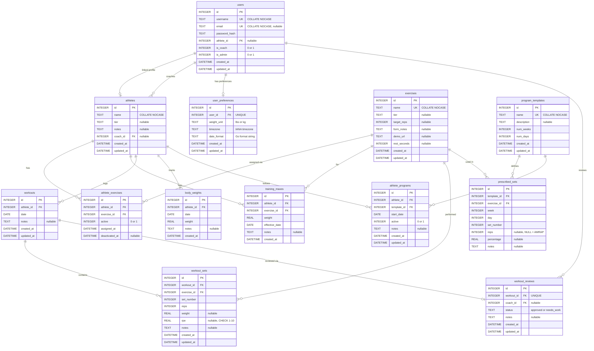

# Data Model

> RepLog schema — designed during bootstrap Feb 2026, updated for v1.1 enhancements.

## Design Decisions

These were resolved interactively before schema design:

1. **Tier lives on both athlete and exercise.** Exercise tier is classification (lunges are Foundational). Athlete tier is the coach's current assessment. The assignment table is the source of truth for "what does this person do today" — tier is not a hard constraint.

2. **Renamed `kids` → `athletes`.** The app tracks both kids (tier-based progression) and adults (percentage-based programs like 5/3/1). Tier is nullable — adults don't need it.

3. **Logging is per-set.** One row = one set = reps + weight. You can see set-to-set fatigue and partial completions. Easy to aggregate up, impossible to disaggregate down.

4. **A thin `workouts` table groups sets.** Without it you'd query by date and hope timestamps cluster. A workout row gives you a clean FK, a place for session-level notes, and simple history queries.

5. **Training maxes are a first-class entity.** Required for percentage-based programs (5/3/1, GZCL). Multiple rows per exercise track TM progression over time. Even without a program engine, seeing "that was 85% of my TM" is useful.

6. **Assignments use an `active` flag, not hard deletes.** Deactivating preserves history. `assigned_at` / `deactivated_at` give you a timeline. Reactivation creates a **new row** (not a flag flip) — the new `assigned_at` reflects the reactivation date, preserving the full audit trail.

7. **Athletes can log any exercise, not just assigned ones.** The daily view highlights assigned exercises, but the logging UI has access to the full exercise library. This allows accessory work, one-off movements, and trying new exercises without formal assignment.

8. **Users and athletes are separate entities.** Users are login accounts (username + password hash + email). Athletes are training subjects. A user links to an athlete via `athlete_id` — coaches can manage all athletes, non-coaches can only view/log their own. The bootstrap logic auto-creates the first user (as coach) from env vars on first run.

9. **Three-tier access control: admin, coach, athlete.** Admins see and manage all athletes and users. Coaches see only athletes assigned to them (`coach_id`). Non-coach users (athletes) are linked to exactly one athlete and can only view/log/edit their own workouts. Roles overlap — an admin can also be a coach, and an athlete can also be a coach. The `is_admin` and `is_coach` flags on the users table control permissions.

10. **Program templates are separate from the logbook.** The app's core is a logbook — it records what happened. Program templates layer on a prescription engine: coaches define templates (weeks × days × prescribed sets with percentages), assign them to athletes, and the app calculates today's target weights from training maxes. Position advances by counting completed workouts since assignment start, and cycles repeat automatically.

11. **Foreign key delete behaviors are intentional.** Deleting an athlete cascades to their workouts, assignments, and training maxes. Deleting a user only unlinks their athlete profile (`SET NULL`). Deleting an exercise is restricted (`RESTRICT`) if it has been logged in any workout — prevents orphaned history.

## Entity Relationship Diagram



## Schema

### `users`

| Column          | Type         | Constraints                          |
|----------------|-------------|--------------------------------------|
| `id`           | INTEGER      | PRIMARY KEY AUTOINCREMENT            |
| `username`     | TEXT         | NOT NULL UNIQUE COLLATE NOCASE       |
| `email`        | TEXT         | NULL UNIQUE COLLATE NOCASE            |
| `password_hash`| TEXT         | NOT NULL                             |
| `athlete_id`   | INTEGER      | NULL, FK → athletes(id)              |
| `is_coach`     | INTEGER      | NOT NULL DEFAULT 0, CHECK(is_coach IN (0, 1)) |
| `created_at`   | DATETIME     | NOT NULL DEFAULT CURRENT_TIMESTAMP   |
| `updated_at`   | DATETIME     | NOT NULL DEFAULT CURRENT_TIMESTAMP   |

- Login accounts, not training subjects. Separate from athletes.
- `email` for password reset or notifications in the future. Required for coaches, optional for kids.
- `athlete_id` links the user to "their" athlete profile. NULL for coach-only accounts without a personal training profile.
- `is_coach = 1` → full access to all athletes. `is_coach = 0` → can only view/log/edit workouts for their linked athlete.
- `COLLATE NOCASE` prevents "Admin" and "admin" or duplicate emails.
- Bootstrap: if `COUNT(*) = 0` on startup, insert from `REPLOG_ADMIN_USER` / `REPLOG_ADMIN_PASS` / `REPLOG_ADMIN_EMAIL` env vars with `is_coach = 1`.

### `user_preferences`

| Column        | Type         | Constraints                          |
|--------------|-------------|--------------------------------------|
| `id`         | INTEGER      | PRIMARY KEY AUTOINCREMENT            |
| `user_id`    | INTEGER      | NOT NULL UNIQUE, FK → users(id) ON DELETE CASCADE |
| `weight_unit`| TEXT         | NOT NULL DEFAULT 'lbs', CHECK(weight_unit IN ('lbs', 'kg')) |
| `timezone`   | TEXT         | NOT NULL DEFAULT 'America/New_York'  |
| `date_format`| TEXT         | NOT NULL DEFAULT 'Jan 2, 2006'       |
| `created_at` | DATETIME     | NOT NULL DEFAULT CURRENT_TIMESTAMP   |
| `updated_at` | DATETIME     | NOT NULL DEFAULT CURRENT_TIMESTAMP   |

- One row per user — stores display and locale preferences.
- `weight_unit` controls how weights are labeled throughout the UI ('lbs' or 'kg'). Weights are stored in the user's chosen unit — no automatic conversion.
- `timezone` is an IANA timezone identifier (e.g. 'America/New_York', 'Europe/London'). Used for displaying dates in the user's local time.
- `date_format` is a Go `time.Format` string (e.g. 'Jan 2, 2006', '2006-01-02', '01/02/2006').
- Default preferences are seeded on login if no row exists.
- Deleting a user cascades to their preferences.

### `athletes`

| Column       | Type         | Constraints                          |
|-------------|-------------|--------------------------------------|
| `id`        | INTEGER      | PRIMARY KEY AUTOINCREMENT            |
| `name`      | TEXT         | NOT NULL COLLATE NOCASE               |
| `tier`      | TEXT         | NULL, CHECK(tier IN ('foundational','intermediate','sport_performance')) |
| `notes`     | TEXT         | NULL                                 |
| `created_at`| DATETIME     | NOT NULL DEFAULT CURRENT_TIMESTAMP   |
| `updated_at`| DATETIME     | NOT NULL DEFAULT CURRENT_TIMESTAMP   |

- `tier` is nullable — adults running their own programs don't use the tier system.
- `notes` holds free-form coaching observations ("ready to try intermediate bench").

### `exercises`

| Column       | Type         | Constraints                          |
|-------------|-------------|--------------------------------------|
| `id`        | INTEGER      | PRIMARY KEY AUTOINCREMENT            |
| `name`      | TEXT         | NOT NULL UNIQUE COLLATE NOCASE        |
| `tier`      | TEXT         | NULL, CHECK(tier IN ('foundational','intermediate','sport_performance')) |
| `target_reps`| INTEGER     | NULL                                 |
| `form_notes`| TEXT         | NULL                                 |
| `demo_url`  | TEXT         | NULL                                 |
| `rest_seconds`| INTEGER    | NULL                                 |
| `created_at`| DATETIME     | NOT NULL DEFAULT CURRENT_TIMESTAMP   |
| `updated_at`| DATETIME     | NOT NULL DEFAULT CURRENT_TIMESTAMP   |

- `tier` is nullable — general lifts (squat, bench, deadlift) exist independent of the kids' tier system.
- `target_reps` is the default prescription. Can be overridden per-assignment in the future.
- `form_notes` holds static coaching cues ("keep elbows tucked").
- `rest_seconds` is the recommended rest between sets in seconds. NULL means use the app default (90s). Passed to the client-side rest timer after logging a set.
- `demo_url` links to a video demonstrating proper form.

### `athlete_exercises`

| Column          | Type         | Constraints                          |
|----------------|-------------|--------------------------------------|
| `id`           | INTEGER      | PRIMARY KEY AUTOINCREMENT            |
| `athlete_id`   | INTEGER      | NOT NULL, FK → athletes(id)          |
| `exercise_id`  | INTEGER      | NOT NULL, FK → exercises(id)         |
| `active`       | INTEGER      | NOT NULL DEFAULT 1, CHECK(active IN (0, 1)) |
| `assigned_at`  | DATETIME     | NOT NULL DEFAULT CURRENT_TIMESTAMP   |
| `deactivated_at`| DATETIME    | NULL                                 |

- Partial unique index ensures only one active assignment per athlete+exercise at a time.
- Deactivation sets `active = 0` and populates `deactivated_at`.
- Reactivation creates a new row (preserves audit trail with fresh `assigned_at`).
- History is preserved; query `WHERE active = 1` for current assignments.

### `training_maxes`

| Column          | Type         | Constraints                          |
|----------------|-------------|--------------------------------------|
| `id`           | INTEGER      | PRIMARY KEY AUTOINCREMENT            |
| `athlete_id`   | INTEGER      | NOT NULL, FK → athletes(id)          |
| `exercise_id`  | INTEGER      | NOT NULL, FK → exercises(id)         |
| `weight`       | REAL         | NOT NULL                             |
| `effective_date`| DATE        | NOT NULL                             |
| `notes`        | TEXT         | NULL                                 |
| `created_at`   | DATETIME     | NOT NULL DEFAULT CURRENT_TIMESTAMP   |

- Multiple rows per athlete+exercise track TM progression over time.
- `effective_date` allows backdating or planning ahead.
- Current TM = most recent row by `effective_date` for a given athlete+exercise.

### `workouts`

| Column       | Type         | Constraints                          |
|-------------|-------------|--------------------------------------|
| `id`        | INTEGER      | PRIMARY KEY AUTOINCREMENT            |
| `athlete_id`| INTEGER      | NOT NULL, FK → athletes(id)          |
| `date`      | DATE         | NOT NULL                             |
| `notes`     | TEXT         | NULL                                 |
| `created_at`| DATETIME     | NOT NULL DEFAULT CURRENT_TIMESTAMP   |
| `updated_at`| DATETIME     | NOT NULL DEFAULT CURRENT_TIMESTAMP   |

- One row per training session.
- `notes` holds session-level observations ("knee was bothering her today").
- UNIQUE(athlete_id, date) — one workout per athlete per day for v1.

### `workout_sets`

| Column       | Type         | Constraints                          |
|-------------|-------------|--------------------------------------|
| `id`        | INTEGER      | PRIMARY KEY AUTOINCREMENT            |
| `workout_id`| INTEGER      | NOT NULL, FK → workouts(id)          |
| `exercise_id`| INTEGER     | NOT NULL, FK → exercises(id)         |
| `set_number`| INTEGER      | NOT NULL                             |
| `reps`      | INTEGER      | NOT NULL                             |
| `weight`    | REAL         | NULL                                 |
| `rpe`       | REAL         | NULL, CHECK(rpe >= 1 AND rpe <= 10)  |
| `notes`     | TEXT         | NULL                                 |
| `created_at`| DATETIME     | NOT NULL DEFAULT CURRENT_TIMESTAMP   |
| `updated_at`| DATETIME     | NOT NULL DEFAULT CURRENT_TIMESTAMP   |

- One row = one set.
- `weight` is nullable — bodyweight exercises (push-ups, bear crawls) don't need it.
- `rpe` is rate of perceived exertion (1–10 scale, half-steps allowed). Nullable — only logged when the athlete reports it.
- `set_number` preserves ordering within exercise within workout.
- `notes` holds per-set observations ("form broke down on rep 18").

### `body_weights`

| Column       | Type         | Constraints                          |
|-------------|-------------|--------------------------------------|
| `id`        | INTEGER      | PRIMARY KEY AUTOINCREMENT            |
| `athlete_id`| INTEGER      | NOT NULL, FK → athletes(id)          |
| `date`      | DATE         | NOT NULL                             |
| `weight`    | REAL         | NOT NULL                             |
| `notes`     | TEXT         | NULL                                 |
| `created_at`| DATETIME     | NOT NULL DEFAULT CURRENT_TIMESTAMP   |

- One weigh-in per athlete per day (`UNIQUE(athlete_id, date)`).
- `weight` stored in the athlete's preferred unit (lb or kg) — unit convention is per-deployment, not per-row.
- Deleting an athlete cascades to their body weight history.

### `workout_reviews`

| Column       | Type         | Constraints                          |
|-------------|-------------|--------------------------------------|
| `id`        | INTEGER      | PRIMARY KEY AUTOINCREMENT            |
| `workout_id`| INTEGER      | NOT NULL UNIQUE, FK → workouts(id) ON DELETE CASCADE |
| `coach_id`  | INTEGER      | NULL, FK → users(id) ON DELETE SET NULL |
| `status`    | TEXT         | NOT NULL, CHECK(status IN ('approved', 'needs_work')) |
| `notes`     | TEXT         | NULL                                 |
| `created_at`| DATETIME     | NOT NULL DEFAULT CURRENT_TIMESTAMP   |
| `updated_at`| DATETIME     | NOT NULL DEFAULT CURRENT_TIMESTAMP   |

- One review per workout (`UNIQUE(workout_id)`) — coaches can update their review but there is only one.
- `status` is either `approved` (coach is satisfied) or `needs_work` (coach wants the athlete to address feedback).
- `notes` holds coach feedback ("Great form on the deadlifts! Try to go deeper on squats next time.").
- `coach_id` records which coach submitted the review.
- Deleting a workout cascades to its review. Deleting the reviewing coach sets `coach_id` to NULL, preserving the review.

### `program_templates`

| Column       | Type         | Constraints                          |
|-------------|-------------|--------------------------------------|
| `id`        | INTEGER      | PRIMARY KEY AUTOINCREMENT            |
| `name`      | TEXT         | NOT NULL UNIQUE COLLATE NOCASE        |
| `description`| TEXT        | NULL                                 |
| `num_weeks` | INTEGER      | NOT NULL                             |
| `num_days`  | INTEGER      | NOT NULL                             |
| `created_at`| DATETIME     | NOT NULL DEFAULT CURRENT_TIMESTAMP   |
| `updated_at`| DATETIME     | NOT NULL DEFAULT CURRENT_TIMESTAMP   |

- Defines a reusable training program structure (e.g. "5/3/1 BBB", "GZCL T1/T2/T3").
- `num_weeks` and `num_days` define the cycle length — e.g. 4 weeks × 4 days for 5/3/1.
- Templates are shared across athletes; assignment is tracked via `athlete_programs`.

### `prescribed_sets`

| Column       | Type         | Constraints                          |
|-------------|-------------|--------------------------------------|
| `id`        | INTEGER      | PRIMARY KEY AUTOINCREMENT            |
| `template_id`| INTEGER     | NOT NULL, FK → program_templates(id) |
| `exercise_id`| INTEGER     | NOT NULL, FK → exercises(id)         |
| `week`      | INTEGER      | NOT NULL                             |
| `day`       | INTEGER      | NOT NULL                             |
| `set_number`| INTEGER      | NOT NULL                             |
| `reps`      | INTEGER      | NULL (NULL = AMRAP)                  |
| `percentage`| REAL         | NULL (% of training max)             |
| `notes`     | TEXT         | NULL                                 |

- Each row is one prescribed set within a template's week/day.
- `reps = NULL` indicates an AMRAP (as many reps as possible) set.
- `percentage` is a decimal (e.g. 65.0 for 65%) used to calculate target weight from the athlete's training max.
- `UNIQUE(template_id, exercise_id, week, day, set_number)` prevents duplicate sets.

### `athlete_programs`

| Column       | Type         | Constraints                          |
|-------------|-------------|--------------------------------------|
| `id`        | INTEGER      | PRIMARY KEY AUTOINCREMENT            |
| `athlete_id`| INTEGER      | NOT NULL, FK → athletes(id)          |
| `template_id`| INTEGER     | NOT NULL, FK → program_templates(id) |
| `start_date`| DATE         | NOT NULL                             |
| `active`    | INTEGER      | NOT NULL DEFAULT 1, CHECK(0 or 1)    |
| `notes`     | TEXT         | NULL                                 |
| `created_at`| DATETIME     | NOT NULL DEFAULT CURRENT_TIMESTAMP   |
| `updated_at`| DATETIME     | NOT NULL DEFAULT CURRENT_TIMESTAMP   |

- Links an athlete to a program template.
- Partial unique index enforces one active program per athlete.
- Deactivation sets `active = 0`; reassignment creates a new row.
- `start_date` is the reference point for calculating program position — position advances by counting completed workouts since start.
- Program cycles repeat automatically when all weeks × days are exhausted.

## SQLite DDL

```sql
PRAGMA journal_mode = WAL;
PRAGMA busy_timeout = 5000;
PRAGMA foreign_keys = ON;

CREATE TABLE IF NOT EXISTS athletes (
    id          INTEGER PRIMARY KEY AUTOINCREMENT,
    name        TEXT    NOT NULL COLLATE NOCASE,
    tier        TEXT    CHECK(tier IN ('foundational', 'intermediate', 'sport_performance')),
    notes       TEXT,
    coach_id    INTEGER REFERENCES users(id) ON DELETE SET NULL,
    created_at  DATETIME NOT NULL DEFAULT CURRENT_TIMESTAMP,
    updated_at  DATETIME NOT NULL DEFAULT CURRENT_TIMESTAMP
);

CREATE TABLE IF NOT EXISTS users (
    id              INTEGER PRIMARY KEY AUTOINCREMENT,
    username        TEXT    NOT NULL UNIQUE COLLATE NOCASE,
    email           TEXT    UNIQUE COLLATE NOCASE,
    password_hash   TEXT    NOT NULL,
    athlete_id      INTEGER REFERENCES athletes(id) ON DELETE SET NULL,
    is_coach        INTEGER NOT NULL DEFAULT 0 CHECK(is_coach IN (0, 1)),
    is_admin        INTEGER NOT NULL DEFAULT 0 CHECK(is_admin IN (0, 1)),
    created_at      DATETIME NOT NULL DEFAULT CURRENT_TIMESTAMP,
    updated_at      DATETIME NOT NULL DEFAULT CURRENT_TIMESTAMP
);

CREATE TABLE IF NOT EXISTS user_preferences (
    id          INTEGER PRIMARY KEY AUTOINCREMENT,
    user_id     INTEGER NOT NULL UNIQUE REFERENCES users(id) ON DELETE CASCADE,
    weight_unit TEXT    NOT NULL DEFAULT 'lbs' CHECK(weight_unit IN ('lbs', 'kg')),
    timezone    TEXT    NOT NULL DEFAULT 'America/New_York',
    date_format TEXT    NOT NULL DEFAULT 'Jan 2, 2006',
    created_at  DATETIME NOT NULL DEFAULT CURRENT_TIMESTAMP,
    updated_at  DATETIME NOT NULL DEFAULT CURRENT_TIMESTAMP
);

CREATE TABLE IF NOT EXISTS exercises (
    id           INTEGER PRIMARY KEY AUTOINCREMENT,
    name         TEXT    NOT NULL UNIQUE COLLATE NOCASE,
    tier         TEXT    CHECK(tier IN ('foundational', 'intermediate', 'sport_performance')),
    target_reps  INTEGER,
    form_notes   TEXT,
    demo_url     TEXT,
    rest_seconds INTEGER,
    created_at   DATETIME NOT NULL DEFAULT CURRENT_TIMESTAMP,
    updated_at   DATETIME NOT NULL DEFAULT CURRENT_TIMESTAMP
);

CREATE TABLE IF NOT EXISTS athlete_exercises (
    id              INTEGER PRIMARY KEY AUTOINCREMENT,
    athlete_id      INTEGER NOT NULL REFERENCES athletes(id) ON DELETE CASCADE,
    exercise_id     INTEGER NOT NULL REFERENCES exercises(id) ON DELETE CASCADE,
    active          INTEGER NOT NULL DEFAULT 1 CHECK(active IN (0, 1)),
    assigned_at     DATETIME NOT NULL DEFAULT CURRENT_TIMESTAMP,
    deactivated_at  DATETIME
);

CREATE TABLE IF NOT EXISTS training_maxes (
    id              INTEGER PRIMARY KEY AUTOINCREMENT,
    athlete_id      INTEGER NOT NULL REFERENCES athletes(id) ON DELETE CASCADE,
    exercise_id     INTEGER NOT NULL REFERENCES exercises(id) ON DELETE CASCADE,
    weight          REAL    NOT NULL,
    effective_date  DATE    NOT NULL,
    notes           TEXT,
    created_at      DATETIME NOT NULL DEFAULT CURRENT_TIMESTAMP,
    UNIQUE(athlete_id, exercise_id, effective_date)
);

CREATE TABLE IF NOT EXISTS workouts (
    id          INTEGER PRIMARY KEY AUTOINCREMENT,
    athlete_id  INTEGER NOT NULL REFERENCES athletes(id) ON DELETE CASCADE,
    date        DATE    NOT NULL,
    notes       TEXT,
    created_at  DATETIME NOT NULL DEFAULT CURRENT_TIMESTAMP,
    updated_at  DATETIME NOT NULL DEFAULT CURRENT_TIMESTAMP,
    UNIQUE(athlete_id, date)
);

CREATE TABLE IF NOT EXISTS workout_sets (
    id          INTEGER PRIMARY KEY AUTOINCREMENT,
    workout_id  INTEGER NOT NULL REFERENCES workouts(id) ON DELETE CASCADE,
    exercise_id INTEGER NOT NULL REFERENCES exercises(id) ON DELETE RESTRICT,
    set_number  INTEGER NOT NULL,
    reps        INTEGER NOT NULL,
    weight      REAL,
    rpe         REAL    CHECK(rpe >= 1 AND rpe <= 10),
    notes       TEXT,
    created_at  DATETIME NOT NULL DEFAULT CURRENT_TIMESTAMP,
    updated_at  DATETIME NOT NULL DEFAULT CURRENT_TIMESTAMP,
    UNIQUE(workout_id, exercise_id, set_number)
);

-- Indexes for common query patterns
CREATE UNIQUE INDEX IF NOT EXISTS idx_athlete_exercises_unique_active
    ON athlete_exercises(athlete_id, exercise_id) WHERE active = 1;

CREATE UNIQUE INDEX IF NOT EXISTS idx_users_unique_athlete_id
    ON users(athlete_id) WHERE athlete_id IS NOT NULL;

CREATE INDEX IF NOT EXISTS idx_athletes_coach_id
    ON athletes(coach_id);

CREATE INDEX IF NOT EXISTS idx_athlete_exercises_athlete_id
    ON athlete_exercises(athlete_id);

CREATE INDEX IF NOT EXISTS idx_workout_sets_workout
    ON workout_sets(workout_id);

CREATE TABLE IF NOT EXISTS body_weights (
    id          INTEGER PRIMARY KEY AUTOINCREMENT,
    athlete_id  INTEGER NOT NULL REFERENCES athletes(id) ON DELETE CASCADE,
    date        DATE    NOT NULL,
    weight      REAL    NOT NULL,
    notes       TEXT,
    created_at  DATETIME NOT NULL DEFAULT CURRENT_TIMESTAMP,
    UNIQUE(athlete_id, date)
);

CREATE INDEX IF NOT EXISTS idx_body_weights_athlete_date
    ON body_weights(athlete_id, date DESC);

-- Triggers for updated_at timestamps
-- WHEN guard prevents infinite recursion (trigger fires UPDATE, which would fire trigger again)
CREATE TRIGGER IF NOT EXISTS trigger_users_updated_at
AFTER UPDATE ON users FOR EACH ROW
WHEN OLD.updated_at = NEW.updated_at
BEGIN
    UPDATE users SET updated_at = CURRENT_TIMESTAMP WHERE id = NEW.id;
END;

CREATE TRIGGER IF NOT EXISTS trigger_user_preferences_updated_at
AFTER UPDATE ON user_preferences FOR EACH ROW
WHEN OLD.updated_at = NEW.updated_at
BEGIN
    UPDATE user_preferences SET updated_at = CURRENT_TIMESTAMP WHERE id = NEW.id;
END;

CREATE TRIGGER IF NOT EXISTS trigger_athletes_updated_at
AFTER UPDATE ON athletes FOR EACH ROW
WHEN OLD.updated_at = NEW.updated_at
BEGIN
    UPDATE athletes SET updated_at = CURRENT_TIMESTAMP WHERE id = NEW.id;
END;

CREATE TRIGGER IF NOT EXISTS trigger_exercises_updated_at
AFTER UPDATE ON exercises FOR EACH ROW
WHEN OLD.updated_at = NEW.updated_at
BEGIN
    UPDATE exercises SET updated_at = CURRENT_TIMESTAMP WHERE id = NEW.id;
END;

CREATE TRIGGER IF NOT EXISTS trigger_workouts_updated_at
AFTER UPDATE ON workouts FOR EACH ROW
WHEN OLD.updated_at = NEW.updated_at
BEGIN
    UPDATE workouts SET updated_at = CURRENT_TIMESTAMP WHERE id = NEW.id;
END;

CREATE TRIGGER IF NOT EXISTS trigger_workout_sets_updated_at
AFTER UPDATE ON workout_sets FOR EACH ROW
WHEN OLD.updated_at = NEW.updated_at
BEGIN
    UPDATE workout_sets SET updated_at = CURRENT_TIMESTAMP WHERE id = NEW.id;
END;

CREATE TABLE IF NOT EXISTS workout_reviews (
    id          INTEGER PRIMARY KEY AUTOINCREMENT,
    workout_id  INTEGER NOT NULL UNIQUE REFERENCES workouts(id) ON DELETE CASCADE,
    coach_id    INTEGER REFERENCES users(id) ON DELETE SET NULL,
    status      TEXT    NOT NULL CHECK(status IN ('approved', 'needs_work')),
    notes       TEXT,
    created_at  DATETIME NOT NULL DEFAULT CURRENT_TIMESTAMP,
    updated_at  DATETIME NOT NULL DEFAULT CURRENT_TIMESTAMP
);

CREATE INDEX IF NOT EXISTS idx_workout_reviews_workout_id
    ON workout_reviews(workout_id);

CREATE INDEX IF NOT EXISTS idx_workout_reviews_status
    ON workout_reviews(status);

CREATE TRIGGER IF NOT EXISTS trigger_workout_reviews_updated_at
AFTER UPDATE ON workout_reviews FOR EACH ROW
WHEN OLD.updated_at = NEW.updated_at
BEGIN
    UPDATE workout_reviews SET updated_at = CURRENT_TIMESTAMP WHERE id = NEW.id;
END;

CREATE TABLE IF NOT EXISTS program_templates (
    id          INTEGER PRIMARY KEY AUTOINCREMENT,
    name        TEXT    NOT NULL UNIQUE COLLATE NOCASE,
    description TEXT,
    num_weeks   INTEGER NOT NULL,
    num_days    INTEGER NOT NULL,
    created_at  DATETIME NOT NULL DEFAULT CURRENT_TIMESTAMP,
    updated_at  DATETIME NOT NULL DEFAULT CURRENT_TIMESTAMP
);

CREATE TABLE IF NOT EXISTS prescribed_sets (
    id           INTEGER PRIMARY KEY AUTOINCREMENT,
    template_id  INTEGER NOT NULL REFERENCES program_templates(id) ON DELETE CASCADE,
    exercise_id  INTEGER NOT NULL REFERENCES exercises(id) ON DELETE CASCADE,
    week         INTEGER NOT NULL,
    day          INTEGER NOT NULL,
    set_number   INTEGER NOT NULL,
    reps         INTEGER,
    percentage   REAL,
    notes        TEXT,
    UNIQUE(template_id, exercise_id, week, day, set_number)
);

CREATE INDEX IF NOT EXISTS idx_prescribed_sets_template
    ON prescribed_sets(template_id);

CREATE TABLE IF NOT EXISTS athlete_programs (
    id           INTEGER PRIMARY KEY AUTOINCREMENT,
    athlete_id   INTEGER NOT NULL REFERENCES athletes(id) ON DELETE CASCADE,
    template_id  INTEGER NOT NULL REFERENCES program_templates(id) ON DELETE RESTRICT,
    start_date   DATE    NOT NULL,
    active       INTEGER NOT NULL DEFAULT 1 CHECK(active IN (0, 1)),
    notes        TEXT,
    created_at   DATETIME NOT NULL DEFAULT CURRENT_TIMESTAMP,
    updated_at   DATETIME NOT NULL DEFAULT CURRENT_TIMESTAMP
);

CREATE UNIQUE INDEX IF NOT EXISTS idx_athlete_programs_active
    ON athlete_programs(athlete_id) WHERE active = 1;

CREATE TRIGGER IF NOT EXISTS trigger_program_templates_updated_at
AFTER UPDATE ON program_templates FOR EACH ROW
WHEN OLD.updated_at = NEW.updated_at
BEGIN
    UPDATE program_templates SET updated_at = CURRENT_TIMESTAMP WHERE id = NEW.id;
END;

CREATE TRIGGER IF NOT EXISTS trigger_athlete_programs_updated_at
AFTER UPDATE ON athlete_programs FOR EACH ROW
WHEN OLD.updated_at = NEW.updated_at
BEGIN
    UPDATE athlete_programs SET updated_at = CURRENT_TIMESTAMP WHERE id = NEW.id;
END;

CREATE TABLE IF NOT EXISTS login_tokens (
    id          INTEGER PRIMARY KEY AUTOINCREMENT,
    user_id     INTEGER NOT NULL REFERENCES users(id) ON DELETE CASCADE,
    token       TEXT    NOT NULL UNIQUE,
    label       TEXT,
    expires_at  DATETIME,
    created_at  DATETIME NOT NULL DEFAULT CURRENT_TIMESTAMP
);

CREATE INDEX IF NOT EXISTS idx_login_tokens_token ON login_tokens(token);
CREATE INDEX IF NOT EXISTS idx_login_tokens_user_id ON login_tokens(user_id);

CREATE TABLE IF NOT EXISTS webauthn_credentials (
    id              INTEGER PRIMARY KEY AUTOINCREMENT,
    user_id         INTEGER NOT NULL REFERENCES users(id) ON DELETE CASCADE,
    credential_id   BLOB    NOT NULL UNIQUE,
    public_key      BLOB    NOT NULL,
    attestation_type TEXT   NOT NULL DEFAULT '',
    transport       TEXT,
    sign_count      INTEGER NOT NULL DEFAULT 0,
    clone_warning   INTEGER NOT NULL DEFAULT 0 CHECK(clone_warning IN (0, 1)),
    attachment      TEXT    NOT NULL DEFAULT '',
    aaguid          BLOB,
    flags_user_present    INTEGER NOT NULL DEFAULT 0 CHECK(flags_user_present IN (0, 1)),
    flags_user_verified   INTEGER NOT NULL DEFAULT 0 CHECK(flags_user_verified IN (0, 1)),
    flags_backup_eligible INTEGER NOT NULL DEFAULT 0 CHECK(flags_backup_eligible IN (0, 1)),
    flags_backup_state    INTEGER NOT NULL DEFAULT 0 CHECK(flags_backup_state IN (0, 1)),
    label           TEXT,
    created_at      DATETIME NOT NULL DEFAULT CURRENT_TIMESTAMP
);

CREATE INDEX IF NOT EXISTS idx_webauthn_credentials_user_id ON webauthn_credentials(user_id);
```

## Seed Data (Development)

```sql
-- Tier exercises
INSERT INTO exercises (name, tier, target_reps, form_notes) VALUES
    ('Lunges', 'foundational', 20, 'Keep front knee over ankle, torso upright'),
    ('Push-ups', 'foundational', 20, 'Full range of motion, elbows at 45 degrees'),
    ('Goblet Squats', 'foundational', 20, 'Hold weight at chest, sit back into heels'),
    ('Bear Crawls', 'foundational', 20, 'Keep hips low, opposite hand-foot movement'),
    ('Bench Press', 'intermediate', 15, 'Training bar. Feet flat, arch back slightly, control the descent'),
    ('Dumbbell Snatch', 'intermediate', 15, 'Start from hang position, explosive hip drive'),
    ('Cleans', 'sport_performance', NULL, 'Full clean from floor, catch in front rack'),
    ('Deadlifts', 'sport_performance', NULL, 'Traditional stance, neutral spine throughout');

-- General lifts (no tier)
INSERT INTO exercises (name, tier, target_reps, form_notes) VALUES
    ('Back Squat', NULL, NULL, 'Break parallel, drive knees out'),
    ('Overhead Press', NULL, NULL, 'Strict press, no leg drive');
```

## Operational Notes

- **Connection pooling:** Go's `database/sql` must be configured with `db.SetMaxOpenConns(1)` for SQLite's single-writer model.
- **Busy timeout:** `PRAGMA busy_timeout = 5000` is set in the DDL — concurrent reads will wait up to 5s during writes instead of failing immediately.
- **Backups:** Do NOT use `cp` on a live WAL-mode database. Use `sqlite3 replog.db ".backup backup.db"` or the SQLite backup API, which correctly handles the WAL file.
- **WAL mode:** Set once; persists across connections. Provides concurrent reads with single-writer without blocking.

## Future Considerations (v2+)

- **Exercise categories/tags**: Muscle group, movement pattern (push/pull/hinge/squat/carry).
- **Auto-progression rules**: Optional per-template rules for automatic training max bumps (e.g. +5 lb on successful cycle completion).
- **Program template sharing/import**: JSON export/import of templates between deployments.
